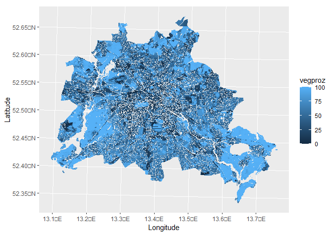

rSCOPE - Berlin Atlas data
================
AlbyDR
2021-11-16

``` r
invisible(lapply(c("rSCOPE", "leaflet", "raster", "sf", "tidyverse","lubridate" ,"ggplot2", "ggspatial"), 
                 library, character.only = T, quietly = TRUE, warn.conflicts = F))
```


### Polygons from BERLIN ENVIRONMENT ATLAS
############################################################# 
``` r
# Impreviousmap <- get_fisbroker_map(url = "https://fbinter.stadt-berlin.de/fb/wfs/data/senstadt/sach_nutz2015_nutzsa")
Green.blocks <- get_fisbroker_map(url = "https://fbinter.stadt-berlin.de/fb/wfs/data/senstadt/s_05_09_gruenvol2010")
```

    ## [1] "https://fbinter.stadt-berlin.de/fb/wfs/data/senstadt/s_05_09_gruenvol2010?service=wfs&version=2.0.0&request=GetFeature&srsName=EPSG%3A25833&TYPENAMES=s_05_09_gruenvol2010"

``` r
Green.street <- get_fisbroker_map(url = "https://fbinter.stadt-berlin.de/fb/wfs/data/senstadt/wfs_05_09_gruenvol2010_str")
```

    ## [1] "https://fbinter.stadt-berlin.de/fb/wfs/data/senstadt/wfs_05_09_gruenvol2010_str?service=wfs&version=2.0.0&request=GetFeature&srsName=EPSG%3A25833&TYPENAMES=wfs_05_09_gruenvol2010_str"

#### plot it

``` r
ggplot(Green.blocks) +
  geom_sf(color = "transparent", size = 0, aes(fill = vegproz)) +
  xlab("Longitude") + 
  ylab("Latitude")
```

<!-- -->

#### zoom it

``` r
plot(extent(381673,388803,5811189,5821467), col=NA)
plot(Green.blocks["vegproz"], add = T, border = "transparent", col=rev(terrain.colors(10))) # street and water NA
```
<!-- -->

it has no streets

#### Vegetation height - combine Block and Streets

``` r
veg_height <- rbind(Green.blocks["veghoe"], Green.street["veghoe"])
veg_height <- sf::st_cast(veg_height)
```

``` r
names(veg_height)[1] <- "veg_height"
summary(veg_height)
```

    ##    veg_height              geometry    
    ##  Min.   : 0.000   MULTIPOLYGON :32685  
    ##  1st Qu.: 3.100   epsg:NA      :    0  
    ##  Median : 6.100   +proj=utm ...:    0  
    ##  Mean   : 6.948                        
    ##  3rd Qu.: 9.400                        
    ##  Max.   :30.700

#### zoom with streets too

``` r
plot(extent(381673,388803,5811189,5821467), col=NA)
plot(veg_height["veg_height"], add = T, border = "transparent", 
     col=rev(terrain.colors(10))) # street and water NA
```
<!-- -->

#### plot nicely!

``` r
ggplot() + 
  geom_sf(data = veg_height, aes(fill = veg_height), colour = "transparent") +
  scale_fill_gradientn(breaks = seq(0,32,4), limits = c(0,32),
                       colors = rev(terrain.colors(10)), name = "", na.value = 0,
                       guide = guide_colorbar(direction = "horizontal", label.position = "bottom",
                                              label.vjust = -2, frame.colour = "black",
                                              frame.linewidth = 0.5, frame.linetype = 1,
                                              barwidth = 35, barheight = 1.5, nbin = 10,
                                              label.theme = element_text(angle = 0, size = 16))) +
  theme(axis.line = element_blank(), axis.text.x = element_blank(), axis.text.y = element_blank(),
        axis.ticks = element_blank(), axis.title.x = element_blank(), axis.title.y = element_blank(),
        legend.position="bottom",
        legend.spacing.y = unit(-0.4, "lines"), legend.box.spacing = unit(-1.5, "lines"),
        panel.grid.major = element_blank(), panel.background = element_rect("white"))
```

<!-- -->

#### Convert to a raster

``` r
# atlas_VH_rDWD <- fasterize::fasterize(veg_height, krg_Ta[[1]], field = "veg_height", fun = "max")
# plot(atlas_VH_rDWD)
```
