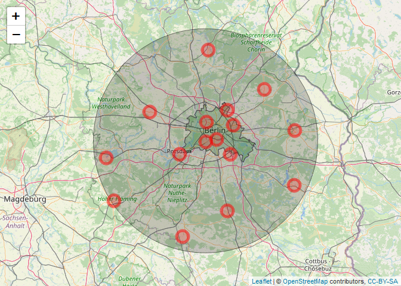
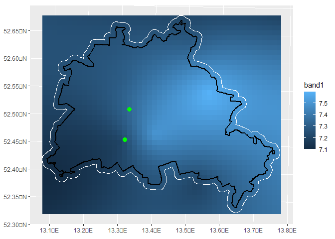

rSCOPE - DWD data
================
AlbyDR
2021-11-16

``` r
invisible(lapply(c("rSCOPE", "leaflet", "raster", "sf", "tidyverse","lubridate" ,"ggplot2", "ggspatial"), 
                 library, character.only = T, quietly = TRUE, warn.conflicts = F))
```
################################################################################################## 

``` r
load(url("https://userpage.fu-berlin.de/soga/300/30100_data_sets/berlin_district.RData")) # berlin border
Berlin_border_longlat <- st_transform(berlin.sf, crs = "+proj=longlat +datum=WGS84")
Berlin_border_utm <- sf::st_transform(berlin.sf, "+proj=utm +zone=33 +datum=WGS84 +units=m +no_defs")
```
#### Mask based on Berlin border
``` r
Berlin_buffer_utm = sf::st_buffer(Berlin_border_utm, 1000)
```

#################################################################################### 
#### Tower points
``` r
tower_points <- matrix(c(13.315827, 13.32785, 52.457232, 52.51228), ncol = 2)
tower_points <- data.frame(x = tower_points[,1], y = tower_points[,2])
coordinates(tower_points) = c("x", "y") 
proj4string(tower_points) <- CRS("+proj=longlat +datum=WGS84")
tower_points_utm <- spTransform(tower_points, "+proj=utm +zone=33 +datum=WGS84 +units=m +no_defs")
```
################################################################################################ 
#### Metadata
################################################################################################ 
#### “precipitation” ; “air_temperature” ; “extreme_temperature” ; “extreme_wind” ; “solar” ; “wind” ; “wind_test” ; “soil” ; “more_precip” ; “weather_phenomena” ; “soil_temperature” ; “water_equiv” ; “cloud_type” ; “cloudiness” ; “dew_point” ; “moisture” ; “pressure” ; “sun” ; “visibility” ; “wind_synop”
################################################################################################ 
#### meteo_var = "air_temperature"
#### var_name = "TT_TU", air temperature at 2m height (Ta) 
#### var_name = "RF_TU", relative humidity at 2m height (RH)
################################################################################################ 

``` r
Air_temp <- get_DWDdata(
  lat_center = 52.4537, # Berlin
  lon_center = 13.3017, 
  radius_km = 70,
  time_lag = "hourly",
  period = "historical",
  meteo_var = "air_temperature",
  start_date = "2018-12-31",
  end_date = "2020-12-31",
  var_name = "TT_TU")
```

#### Data

``` r
summary(Air_temp[[1]])
```

    ##    MESS_DATUM                      ID_403          ID_433          ID_430     
    ##  Min.   :2019-01-01 00:00:00   Min.   :-6.70   Min.   :-6.80   Min.   :-6.80  
    ##  1st Qu.:2019-07-02 18:45:00   1st Qu.: 5.30   1st Qu.: 5.70   1st Qu.: 5.50  
    ##  Median :2020-01-01 11:30:00   Median :10.20   Median :10.80   Median :10.60  
    ##  Mean   :2020-01-01 12:04:28   Mean   :11.17   Mean   :11.78   Mean   :11.61  
    ##  3rd Qu.:2020-07-02 06:15:00   3rd Qu.:16.50   3rd Qu.:17.30   3rd Qu.:17.10  
    ##  Max.   :2020-12-31 23:00:00   Max.   :37.50   Max.   :38.10   Max.   :38.40  
    ##      ID_427         ID_3987          ID_420          ID_400        ID_5825     
    ##  Min.   :-6.90   Min.   :-7.20   Min.   :-7.00   Min.   :-7.2   Min.   :-7.00  
    ##  1st Qu.: 5.30   1st Qu.: 5.10   1st Qu.: 5.60   1st Qu.: 5.2   1st Qu.: 5.30  
    ##  Median :10.50   Median :10.20   Median :10.70   Median :10.2   Median :10.30  
    ##  Mean   :11.46   Mean   :11.21   Mean   :11.68   Mean   :11.2   Mean   :11.18  
    ##  3rd Qu.:17.20   3rd Qu.:16.80   3rd Qu.:17.30   3rd Qu.:16.6   3rd Qu.:16.47  
    ##  Max.   :37.90   Max.   :37.70   Max.   :37.60   Max.   :37.5   Max.   :37.30  
    ##      ID_303         ID_7389         ID_3376         ID_5745     
    ##  Min.   :-8.90   Min.   :-7.50   Min.   :-7.30   Min.   :-7.90  
    ##  1st Qu.: 4.80   1st Qu.: 4.70   1st Qu.: 4.80   1st Qu.: 4.70  
    ##  Median :10.00   Median : 9.80   Median : 9.80   Median : 9.80  
    ##  Mean   :10.97   Mean   :10.73   Mean   :10.83   Mean   :10.92  
    ##  3rd Qu.:16.80   3rd Qu.:16.10   3rd Qu.:16.40   3rd Qu.:16.40  
    ##  Max.   :37.30   Max.   :36.50   Max.   :37.00   Max.   :37.50  
    ##     ID_2856         ID_3015         ID_6265         ID_5546     
    ##  Min.   :-7.80   Min.   :-7.40   Min.   :-7.30   Min.   :-9.00  
    ##  1st Qu.: 4.80   1st Qu.: 4.90   1st Qu.: 5.50   1st Qu.: 4.60  
    ##  Median : 9.90   Median :10.20   Median :10.50   Median : 9.80  
    ##  Mean   :10.92   Mean   :11.12   Mean   :11.44   Mean   :10.68  
    ##  3rd Qu.:16.70   3rd Qu.:16.80   3rd Qu.:16.80   3rd Qu.:16.18  
    ##  Max.   :37.10   Max.   :36.60   Max.   :37.70   Max.   :36.90

#### Metadata

``` r
Air_temp[[2]][,c(1,2,3,4,5,6,7,8,13)]
```

    ##       stations_id start_date   end_date station_height latitude longitude  stations_name      region      distance
    ## 6716          403 2002-01-01 2021-05-31             51  52.4537   13.3017  Berlin-Dahlem (FU) Berlin      0.000000
    ## 7385          433 1951-01-01 2021-05-31             48  52.4675   13.4021  Berlin-Tempelhof   Berlin      6.973214
    ## 7274          430 1986-01-01 2021-05-05             36  52.5644   13.3088  Berlin-Tegel       Berlin      12.318653
    ## 7135          427 1973-01-01 2021-05-31             46  52.3807   13.5306  Berlin Brandenburg Brandenburg 17.517807
    ## 61582        3987 1893-01-01 2021-05-31             81  52.3813   13.0622  Potsdam            Brandenburg 18.128080
    ## 6999          420 2007-08-01 2021-05-31             60  52.5447   13.5598  Berlin-Marzahn     Berlin      20.190057
    ## 6581          400 1991-01-01 2021-05-31             60  52.6309   13.5022  Berlin-Buch        Berlin      23.918265
    ## 88176        5825 2004-05-01 2021-05-31             40  52.6198   12.7867  Berge              Brandenburg 39.425453
    ## 4902          303 1993-08-19 2021-05-31             55  52.0613   13.4997  Baruth             Brandenburg 45.666673
    ## 96393        7389 2006-12-01 2021-05-31             82  52.7461   13.8427  Heckelberg         Brandenburg 48.909075
    ## 52574        3376 1991-01-01 2021-05-31             63  52.5176   14.1232  Muencheberg        Brandenburg 56.078100
    ## 87083        5745 1981-01-01 2021-05-31             51  52.9664   13.3268  Zehdenick          Brandenburg 57.034709
    ## 43767        2856 2004-07-01 2021-05-31             91  51.9173   13.0878  Langenlipsdorf     Brandenburg 61.401637
    ## 46206        3015 1951-01-01 2021-05-31             98  52.2085   14.1180  Lindenberg         Brandenburg 61.806610
    ## 92145        6265 2004-05-01 2021-05-31             36  52.3613   12.3867  Wusterwitz         Brandenburg 62.911860
    ## 84236        5546 1986-07-01 2021-05-31            187  52.1207   12.4585  Wiesenburg         Brandenburg 68.266749

``` r
leaflet() %>% addTiles() %>%
  addPolygons(data = Berlin_border_longlat, fillColor = "green", fillOpacity = 0.2, color = "black", weight = 1) %>%
  addCircles(lng=13.3017, lat=52.4537, radius = 70000, fillOpacity = 0.2, color = "black", weight = 1) %>%
  addCircleMarkers(data = Air_temp[[2]], ~longitude, ~latitude, col="red", popup=~stations_name)
```

<!-- -->

#### Air temperature

``` r
length(Air_temp[[1]]$MESS_DATUM)
```

    ## [1] 17544

``` r
krg_Ta <- pbapply::pblapply(1:10, FUN = function(i) 
  interpolate_DWD(var_DWD = as.numeric(Air_temp[[1]][i,-1]),
                  stations_DWD = Air_temp[[2]],
                  res_utm = 1000,
                  radius_km = 70,
                  vgm_model = c("Sph"),
                  crop_extent = raster::extent(Berlin_buffer_utm))) # 
```

``` r
krg_Ta[[1]]
```

    ## class      : RasterLayer 
    ## dimensions : 40, 48, 1920  (nrow, ncol, ncell)
    ## resolution : 1000, 1000  (x, y)
    ## extent     : 368999.8, 416999.8, 5798199, 5838199  (xmin, xmax, ymin, ymax)
    ## crs        : +proj=utm +zone=33 +datum=WGS84 +units=m +no_defs 
    ## source     : memory
    ## names      : var1.pred 
    ## values     : 7.841473, 8.456333  (min, max)

``` r
ggplot() +
  layer_spatial(krg_Ta[[7]]) + 
  scale_fill_continuous(na.value = NA) + 
  layer_spatial(Berlin_buffer_utm, fill = "transparent", size = 0.5, col = "white") + 
  layer_spatial(Berlin_border_utm, fill = "transparent", size = 1, col = "black") + 
  layer_spatial(tower_points, size = 3, col = "green")
```

<!-- -->
