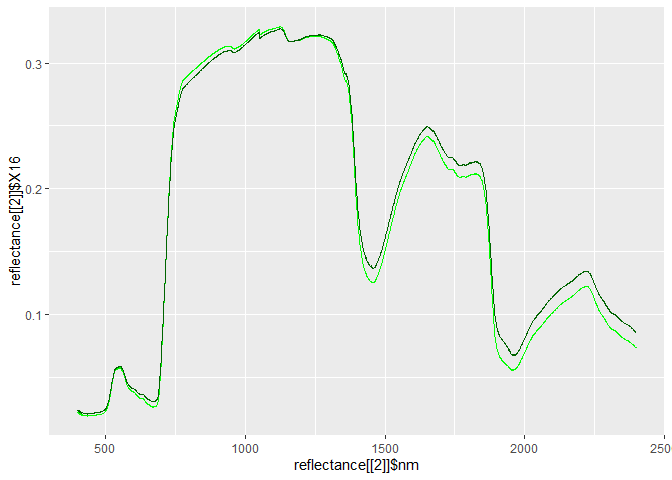

rSCOPE - SCOPE
================
AlbyDR
2021-11-18

``` r
invisible(lapply(c("rSCOPE", "svMisc", "tidyverse","lubridate" ,"ggplot2"), 
                 library, character.only = T, quietly = TRUE, warn.conflicts = F))
```

    ## -- Attaching packages --------------------------------------- tidyverse 1.3.1 --

    ## v ggplot2 3.3.5     v purrr   0.3.4
    ## v tibble  3.1.2     v dplyr   1.0.7
    ## v tidyr   1.1.3     v stringr 1.4.0
    ## v readr   1.4.0     v forcats 0.5.1

    ## -- Conflicts ------------------------------------------ tidyverse_conflicts() --
    ## x dplyr::filter() masks stats::filter()
    ## x dplyr::lag()    masks stats::lag()

#### timeseries model inputs (name in X1)

``` r
print(model_inputs(SCOPE_dir = "D:/SCOPE-master/")[[1]], n = 20) #32
```

    ## 
    ## -- Column specification --------------------------------------------------------
    ## cols(
    ##   X1 = col_character(),
    ##   X2 = col_character()
    ## )

    ## 
    ## -- Column specification --------------------------------------------------------
    ## cols(
    ##   X1 = col_character(),
    ##   X2 = col_double()
    ## )

    ## 
    ## -- Column specification --------------------------------------------------------
    ## cols(
    ##   X1 = col_double(),
    ##   X2 = col_character()
    ## )

    ## # A tibble: 32 x 2
    ##    X1              X2            
    ##    <chr>           <chr>         
    ##  1 Simulation_Name work_shop_    
    ##  2 soil_file       soilROTH.txt  
    ##  3 meteo_ec_csv    csv_inputs.csv
    ##  4 t               t             
    ##  5 Rin             Rin_DWD       
    ##  6 Rli             Rli_DWD       
    ##  7 p               p_DWD         
    ##  8 Ta              Ta_DWD        
    ##  9 u               ws_DWD        
    ## 10 ea              <NA>          
    ## 11 RH              RH_DWD        
    ## 12 tts             tts           
    ## 13 tto             <NA>          
    ## 14 psi             psi           
    ## 15 Cab             <NA>          
    ## 16 Cca             <NA>          
    ## 17 Cdm             <NA>          
    ## 18 Cw              <NA>          
    ## 19 Cs              <NA>          
    ## 20 Cant            <NA>          
    ## # ... with 12 more rows

#### model constants (name\_c)

``` r
print(model_inputs(SCOPE_dir = "D:/SCOPE-master/")[[2]], n = 20) #89
```

    ## 
    ## -- Column specification --------------------------------------------------------
    ## cols(
    ##   X1 = col_character(),
    ##   X2 = col_character()
    ## )

    ## 
    ## -- Column specification --------------------------------------------------------
    ## cols(
    ##   X1 = col_character(),
    ##   X2 = col_double()
    ## )

    ## 
    ## -- Column specification --------------------------------------------------------
    ## cols(
    ##   X1 = col_double(),
    ##   X2 = col_character()
    ## )

    ## # A tibble: 89 x 2
    ##    X1                   X2
    ##    <chr>             <dbl>
    ##  1 PROSPECT         NA    
    ##  2 Cab              40    
    ##  3 Cca              10    
    ##  4 Cdm               0.012
    ##  5 Cw                0.009
    ##  6 Cs                0    
    ##  7 Cant              1    
    ##  8 Cp                0    
    ##  9 Cbc               0    
    ## 10 N                 1.5  
    ## 11 rho_thermal       0.01 
    ## 12 tau_thermal       0.01 
    ## 13 <NA>             NA    
    ## 14 Leaf_Biochemical NA    
    ## 15 Vcmax25          60    
    ## 16 BallBerrySlope    8    
    ## 17 BallBerry0        0.01 
    ## 18 Type              0    
    ## 19 kV                0.64 
    ## 20 Rdparam           0.015
    ## # ... with 69 more rows

#### model settings (name\_c)

``` r
print(model_inputs(SCOPE_dir = "D:/SCOPE-master/")[[3]], n = 18) #18
```

    ## 
    ## -- Column specification --------------------------------------------------------
    ## cols(
    ##   X1 = col_character(),
    ##   X2 = col_character()
    ## )

    ## 
    ## -- Column specification --------------------------------------------------------
    ## cols(
    ##   X1 = col_character(),
    ##   X2 = col_double()
    ## )

    ## 
    ## -- Column specification --------------------------------------------------------
    ## cols(
    ##   X1 = col_double(),
    ##   X2 = col_character()
    ## )

    ## # A tibble: 18 x 2
    ##       X1 X2                 
    ##    <dbl> <chr>              
    ##  1     1 lite               
    ##  2     0 calc_fluor         
    ##  3     0 calc_planck        
    ##  4     0 calc_xanthophyllabs
    ##  5     0 soilspectrum       
    ##  6     0 Fluorescence_model 
    ##  7     1 applTcorr          
    ##  8     0 verify             
    ##  9     1 saveCSV            
    ## 10     0 mSCOPE             
    ## 11     1 simulation         
    ## 12     0 calc_directional   
    ## 13     0 calc_vert_profiles 
    ## 14     1 soil_heat_method   
    ## 15     0 calc_rss_rbs       
    ## 16     1 MoninObukhov       
    ## 17     1 save_spectral      
    ## 18     1 calc_ebal

########################################################################## 

``` r
TUCC_SCOPEinput <- readRDS("EC_TUCC_SCOPE.rds")
ROTH_SCOPEinput <- readRDS("EC_ROTH_SCOPE.rds")
summary(ROTH_SCOPEinput)
```

    ##        t                 Ta_EC            RH_EC            p_EC       
    ##  Min.   :2.019e+11   Min.   :-7.235   Min.   :13.82   Min.   : 971.8  
    ##  1st Qu.:2.019e+11   1st Qu.: 5.451   1st Qu.:54.84   1st Qu.: 998.9  
    ##  Median :2.020e+11   Median :10.666   Median :72.75   Median :1004.8  
    ##  Mean   :2.020e+11   Mean   :11.535   Mean   :69.70   Mean   :1004.6  
    ##  3rd Qu.:2.020e+11   3rd Qu.:17.070   3rd Qu.:86.51   3rd Qu.:1010.9  
    ##  Max.   :2.020e+11   Max.   :36.527   Max.   :99.61   Max.   :1035.5  
    ##                                                                       
    ##      ws_EC             Rin_EC            Rli_EC            zd       
    ##  Min.   : 0.1641   Min.   :  0.000   Min.   :208.7   Min.   :14.52  
    ##  1st Qu.: 2.2258   1st Qu.:  0.000   1st Qu.:293.6   1st Qu.:16.50  
    ##  Median : 2.9233   Median :  2.656   Median :324.0   Median :17.43  
    ##  Mean   : 3.0852   Mean   :133.518   Mean   :321.8   Mean   :18.18  
    ##  3rd Qu.: 3.7857   3rd Qu.:191.397   3rd Qu.:351.5   3rd Qu.:19.29  
    ##  Max.   :11.1023   Max.   :984.511   Max.   :451.1   Max.   :38.27  
    ##                                                                     
    ##      Ta_DWD           RH_DWD          p_DWD            ws_DWD      
    ##  Min.   :-6.717   Min.   :14.75   Min.   : 982.8   Min.   : 0.500  
    ##  1st Qu.: 5.399   1st Qu.:58.40   1st Qu.:1009.2   1st Qu.: 2.115  
    ##  Median :10.396   Median :76.27   Median :1015.4   Median : 2.859  
    ##  Mean   :11.375   Mean   :72.54   Mean   :1015.2   Mean   : 3.057  
    ##  3rd Qu.:16.834   3rd Qu.:89.26   3rd Qu.:1021.8   3rd Qu.: 3.801  
    ##  Max.   :37.776   Max.   :99.99   Max.   :1047.1   Max.   :10.611  
    ##                                                                    
    ##     Rin_DWD         Rin_3987_DWD       Rli_DWD           tts       
    ##  Min.   :  0.000   Min.   :  0.00   Min.   :205.0   Min.   :29.31  
    ##  1st Qu.:  0.000   1st Qu.:  0.00   1st Qu.:291.7   1st Qu.:68.13  
    ##  Median :  6.314   Median :  5.56   Median :322.2   Median :85.00  
    ##  Mean   :138.417   Mean   :132.47   Mean   :320.5   Mean   :74.84  
    ##  3rd Qu.:210.015   3rd Qu.:186.11   3rd Qu.:350.0   3rd Qu.:85.00  
    ##  Max.   :864.749   Max.   :972.22   Max.   :452.8   Max.   :85.00  
    ##                                                                    
    ##       psi              LAI_FP          LAI_extent       LAI_buffer    
    ##  Min.   :  3.529   Min.   :0.05736   Min.   :0.1587   Min.   :0.1450  
    ##  1st Qu.: 52.324   1st Qu.:0.56039   1st Qu.:0.4118   1st Qu.:0.4944  
    ##  Median : 90.582   Median :0.86985   Median :0.7726   Median :0.8087  
    ##  Mean   : 90.183   Mean   :0.97807   Mean   :0.8364   Mean   :0.8819  
    ##  3rd Qu.:128.404   3rd Qu.:1.42093   3rd Qu.:1.3109   3rd Qu.:1.3445  
    ##  Max.   :174.609   Max.   :2.12155   Max.   :1.5417   Max.   :1.5592  
    ##                                                                       
    ##     LAI_1169         LAI_mean         LAI_max           hc_1m       
    ##  Min.   :0.1529   Min.   :0.5844   Min.   :0.4422   Min.   : 1.291  
    ##  1st Qu.:0.4611   1st Qu.:0.7289   1st Qu.:0.9544   1st Qu.: 4.801  
    ##  Median :0.7107   Median :1.3328   Median :2.0615   Median : 5.679  
    ##  Mean   :0.8410   Mean   :1.3693   Mean   :2.4774   Mean   : 5.743  
    ##  3rd Qu.:1.3238   3rd Qu.:1.8580   3rd Qu.:4.1918   3rd Qu.: 6.564  
    ##  Max.   :1.5472   Max.   :2.4726   Max.   :5.4474   Max.   :15.356  
    ##                                                                     
    ##    hc_1m_poly     hc_1m_poly_max      hc_vh         hc_vh_block    
    ##  Min.   : 8.675   Min.   :17.22   Min.   : 4.050   Min.   : 1.261  
    ##  1st Qu.:12.142   1st Qu.:24.27   1st Qu.: 9.034   1st Qu.: 7.399  
    ##  Median :13.073   Median :25.70   Median : 9.639   Median : 8.121  
    ##  Mean   :12.769   Mean   :25.39   Mean   : 9.462   Mean   : 7.993  
    ##  3rd Qu.:13.363   3rd Qu.:26.53   3rd Qu.: 9.987   3rd Qu.: 8.754  
    ##  Max.   :14.354   Max.   :32.76   Max.   :11.157   Max.   :10.292  
    ##                                                                    
    ##    SMC10_DWD           SMC20_DWD          SMC40_DWD        SMC60_DWD     
    ##  Min.   :  0.00002   Min.   : 0.00153   Min.   : 34.91   Min.   : 69.20  
    ##  1st Qu.:  5.92079   1st Qu.: 3.76254   1st Qu.: 55.65   1st Qu.: 77.01  
    ##  Median : 62.75272   Median :57.79334   Median : 75.35   Median : 82.44  
    ##  Mean   : 51.91343   Mean   :47.90869   Mean   : 70.76   Mean   : 83.50  
    ##  3rd Qu.: 91.75662   3rd Qu.:86.19772   3rd Qu.: 83.79   3rd Qu.: 88.84  
    ##  Max.   : 99.99942   Max.   :99.96792   Max.   :100.00   Max.   :100.00  
    ##                                                                          
    ##     SMC10_EC          SMC20_EC          SMC60_EC       dry_hours     
    ##  Min.   : 0.5198   Min.   : 0.0005   Min.   :10.41   Min.   :  0.00  
    ##  1st Qu.: 3.6043   1st Qu.: 1.3269   1st Qu.:12.42   1st Qu.:  8.00  
    ##  Median : 6.2082   Median : 4.3451   Median :21.97   Median : 32.00  
    ##  Mean   : 7.8459   Mean   : 3.8565   Mean   :20.13   Mean   : 61.34  
    ##  3rd Qu.:11.9513   3rd Qu.: 5.2708   3rd Qu.:25.86   3rd Qu.: 87.25  
    ##  Max.   :21.2118   Max.   :11.7913   Max.   :30.41   Max.   :400.00  
    ##                                                                      
    ##   veg_fraction       ET_clean     
    ##  Min.   :0.2203   Min.   :-0.132  
    ##  1st Qu.:0.5542   1st Qu.: 0.011  
    ##  Median :0.6472   Median : 0.026  
    ##  Mean   :0.6231   Mean   : 0.050  
    ##  3rd Qu.:0.6982   3rd Qu.: 0.070  
    ##  Max.   :0.8090   Max.   : 0.269  
    ##                   NA's   :5803

``` r
run_SCOPE(csv_inputs = ROTH_SCOPEinput[4001:4744,],
          Simulation_Name = "work_shop_",
          split = FALSE,
          # variable names
          t = "t", Rin = "Rin_DWD", Rli = "Rli_DWD", 
          p = "p_DWD", Ta = "Ta_DWD", RH = "RH_DWD", ea = NA, 
          u = "ws_DWD", tts = "tts", tto = NA, psi = "psi", 
          SMC = "SMC60_DWD", LAI ="LAI_FP", hc = NA,
          ### constants values (non-default)
          hc_c = 2,
          LAI_c = 3,
          SMC_c = 25,
          z_c = 40, # measurements height
          LAT = 52.45, 
          LON = 13.32, 
          timezn = 0, # Lat/long and time zone
          startDOY = 20190101,
          endDOY = 20210101,  # timestamp period (endDOY should be one day after)
          ### settings values (non-default)
          lite = 1, # faster
          simulation = 1, # time series
          soilspectrum = 0, 
          soil_heat_method = 1, # soil options
          applTcorr = 1,  
          MoninObukhov = 1, 
          calc_rss_rbs = 0, # corrections
          save_spectral = 1)
```

    ## 
    ## -- Column specification --------------------------------------------------------
    ## cols(
    ##   X1 = col_character(),
    ##   X2 = col_character()
    ## )

    ## 
    ## -- Column specification --------------------------------------------------------
    ## cols(
    ##   X1 = col_character(),
    ##   X2 = col_double()
    ## )

    ## 
    ## -- Column specification --------------------------------------------------------
    ## cols(
    ##   X1 = col_double(),
    ##   X2 = col_character()
    ## )

    ## 
    ## -- Column specification --------------------------------------------------------
    ## cols(
    ##   X1 = col_character(),
    ##   X2 = col_character(),
    ##   X3 = col_character()
    ## )

    ## [1] 0

``` r
summary(ROTH_SCOPEinput)
```

    ##        t                 Ta_EC            RH_EC            p_EC       
    ##  Min.   :2.019e+11   Min.   :-7.235   Min.   :13.82   Min.   : 971.8  
    ##  1st Qu.:2.019e+11   1st Qu.: 5.451   1st Qu.:54.84   1st Qu.: 998.9  
    ##  Median :2.020e+11   Median :10.666   Median :72.75   Median :1004.8  
    ##  Mean   :2.020e+11   Mean   :11.535   Mean   :69.70   Mean   :1004.6  
    ##  3rd Qu.:2.020e+11   3rd Qu.:17.070   3rd Qu.:86.51   3rd Qu.:1010.9  
    ##  Max.   :2.020e+11   Max.   :36.527   Max.   :99.61   Max.   :1035.5  
    ##                                                                       
    ##      ws_EC             Rin_EC            Rli_EC            zd       
    ##  Min.   : 0.1641   Min.   :  0.000   Min.   :208.7   Min.   :14.52  
    ##  1st Qu.: 2.2258   1st Qu.:  0.000   1st Qu.:293.6   1st Qu.:16.50  
    ##  Median : 2.9233   Median :  2.656   Median :324.0   Median :17.43  
    ##  Mean   : 3.0852   Mean   :133.518   Mean   :321.8   Mean   :18.18  
    ##  3rd Qu.: 3.7857   3rd Qu.:191.397   3rd Qu.:351.5   3rd Qu.:19.29  
    ##  Max.   :11.1023   Max.   :984.511   Max.   :451.1   Max.   :38.27  
    ##                                                                     
    ##      Ta_DWD           RH_DWD          p_DWD            ws_DWD      
    ##  Min.   :-6.717   Min.   :14.75   Min.   : 982.8   Min.   : 0.500  
    ##  1st Qu.: 5.399   1st Qu.:58.40   1st Qu.:1009.2   1st Qu.: 2.115  
    ##  Median :10.396   Median :76.27   Median :1015.4   Median : 2.859  
    ##  Mean   :11.375   Mean   :72.54   Mean   :1015.2   Mean   : 3.057  
    ##  3rd Qu.:16.834   3rd Qu.:89.26   3rd Qu.:1021.8   3rd Qu.: 3.801  
    ##  Max.   :37.776   Max.   :99.99   Max.   :1047.1   Max.   :10.611  
    ##                                                                    
    ##     Rin_DWD         Rin_3987_DWD       Rli_DWD           tts       
    ##  Min.   :  0.000   Min.   :  0.00   Min.   :205.0   Min.   :29.31  
    ##  1st Qu.:  0.000   1st Qu.:  0.00   1st Qu.:291.7   1st Qu.:68.13  
    ##  Median :  6.314   Median :  5.56   Median :322.2   Median :85.00  
    ##  Mean   :138.417   Mean   :132.47   Mean   :320.5   Mean   :74.84  
    ##  3rd Qu.:210.015   3rd Qu.:186.11   3rd Qu.:350.0   3rd Qu.:85.00  
    ##  Max.   :864.749   Max.   :972.22   Max.   :452.8   Max.   :85.00  
    ##                                                                    
    ##       psi              LAI_FP          LAI_extent       LAI_buffer    
    ##  Min.   :  3.529   Min.   :0.05736   Min.   :0.1587   Min.   :0.1450  
    ##  1st Qu.: 52.324   1st Qu.:0.56039   1st Qu.:0.4118   1st Qu.:0.4944  
    ##  Median : 90.582   Median :0.86985   Median :0.7726   Median :0.8087  
    ##  Mean   : 90.183   Mean   :0.97807   Mean   :0.8364   Mean   :0.8819  
    ##  3rd Qu.:128.404   3rd Qu.:1.42093   3rd Qu.:1.3109   3rd Qu.:1.3445  
    ##  Max.   :174.609   Max.   :2.12155   Max.   :1.5417   Max.   :1.5592  
    ##                                                                       
    ##     LAI_1169         LAI_mean         LAI_max           hc_1m       
    ##  Min.   :0.1529   Min.   :0.5844   Min.   :0.4422   Min.   : 1.291  
    ##  1st Qu.:0.4611   1st Qu.:0.7289   1st Qu.:0.9544   1st Qu.: 4.801  
    ##  Median :0.7107   Median :1.3328   Median :2.0615   Median : 5.679  
    ##  Mean   :0.8410   Mean   :1.3693   Mean   :2.4774   Mean   : 5.743  
    ##  3rd Qu.:1.3238   3rd Qu.:1.8580   3rd Qu.:4.1918   3rd Qu.: 6.564  
    ##  Max.   :1.5472   Max.   :2.4726   Max.   :5.4474   Max.   :15.356  
    ##                                                                     
    ##    hc_1m_poly     hc_1m_poly_max      hc_vh         hc_vh_block    
    ##  Min.   : 8.675   Min.   :17.22   Min.   : 4.050   Min.   : 1.261  
    ##  1st Qu.:12.142   1st Qu.:24.27   1st Qu.: 9.034   1st Qu.: 7.399  
    ##  Median :13.073   Median :25.70   Median : 9.639   Median : 8.121  
    ##  Mean   :12.769   Mean   :25.39   Mean   : 9.462   Mean   : 7.993  
    ##  3rd Qu.:13.363   3rd Qu.:26.53   3rd Qu.: 9.987   3rd Qu.: 8.754  
    ##  Max.   :14.354   Max.   :32.76   Max.   :11.157   Max.   :10.292  
    ##                                                                    
    ##    SMC10_DWD           SMC20_DWD          SMC40_DWD        SMC60_DWD     
    ##  Min.   :  0.00002   Min.   : 0.00153   Min.   : 34.91   Min.   : 69.20  
    ##  1st Qu.:  5.92079   1st Qu.: 3.76254   1st Qu.: 55.65   1st Qu.: 77.01  
    ##  Median : 62.75272   Median :57.79334   Median : 75.35   Median : 82.44  
    ##  Mean   : 51.91343   Mean   :47.90869   Mean   : 70.76   Mean   : 83.50  
    ##  3rd Qu.: 91.75662   3rd Qu.:86.19772   3rd Qu.: 83.79   3rd Qu.: 88.84  
    ##  Max.   : 99.99942   Max.   :99.96792   Max.   :100.00   Max.   :100.00  
    ##                                                                          
    ##     SMC10_EC          SMC20_EC          SMC60_EC       dry_hours     
    ##  Min.   : 0.5198   Min.   : 0.0005   Min.   :10.41   Min.   :  0.00  
    ##  1st Qu.: 3.6043   1st Qu.: 1.3269   1st Qu.:12.42   1st Qu.:  8.00  
    ##  Median : 6.2082   Median : 4.3451   Median :21.97   Median : 32.00  
    ##  Mean   : 7.8459   Mean   : 3.8565   Mean   :20.13   Mean   : 61.34  
    ##  3rd Qu.:11.9513   3rd Qu.: 5.2708   3rd Qu.:25.86   3rd Qu.: 87.25  
    ##  Max.   :21.2118   Max.   :11.7913   Max.   :30.41   Max.   :400.00  
    ##                                                                      
    ##   veg_fraction       ET_clean     
    ##  Min.   :0.2203   Min.   :-0.132  
    ##  1st Qu.:0.5542   1st Qu.: 0.011  
    ##  Median :0.6472   Median : 0.026  
    ##  Mean   :0.6231   Mean   : 0.050  
    ##  3rd Qu.:0.6982   3rd Qu.: 0.070  
    ##  Max.   :0.8090   Max.   : 0.269  
    ##                   NA's   :5803

``` r
vars_comb <- expand_grid("LAI"=c("LAI_buffer", "LAI_mean", "LAI_max", NA), 
                         "hc"=c("hc_vc", NA), 
                         "SMC"=c("SMC20_DWD", "SMC60_DWD", NA))
```

``` r
summary(ROTH_SCOPEinput)
```

    ##        t                 Ta_EC            RH_EC            p_EC       
    ##  Min.   :2.019e+11   Min.   :-7.235   Min.   :13.82   Min.   : 971.8  
    ##  1st Qu.:2.019e+11   1st Qu.: 5.451   1st Qu.:54.84   1st Qu.: 998.9  
    ##  Median :2.020e+11   Median :10.666   Median :72.75   Median :1004.8  
    ##  Mean   :2.020e+11   Mean   :11.535   Mean   :69.70   Mean   :1004.6  
    ##  3rd Qu.:2.020e+11   3rd Qu.:17.070   3rd Qu.:86.51   3rd Qu.:1010.9  
    ##  Max.   :2.020e+11   Max.   :36.527   Max.   :99.61   Max.   :1035.5  
    ##                                                                       
    ##      ws_EC             Rin_EC            Rli_EC            zd       
    ##  Min.   : 0.1641   Min.   :  0.000   Min.   :208.7   Min.   :14.52  
    ##  1st Qu.: 2.2258   1st Qu.:  0.000   1st Qu.:293.6   1st Qu.:16.50  
    ##  Median : 2.9233   Median :  2.656   Median :324.0   Median :17.43  
    ##  Mean   : 3.0852   Mean   :133.518   Mean   :321.8   Mean   :18.18  
    ##  3rd Qu.: 3.7857   3rd Qu.:191.397   3rd Qu.:351.5   3rd Qu.:19.29  
    ##  Max.   :11.1023   Max.   :984.511   Max.   :451.1   Max.   :38.27  
    ##                                                                     
    ##      Ta_DWD           RH_DWD          p_DWD            ws_DWD      
    ##  Min.   :-6.717   Min.   :14.75   Min.   : 982.8   Min.   : 0.500  
    ##  1st Qu.: 5.399   1st Qu.:58.40   1st Qu.:1009.2   1st Qu.: 2.115  
    ##  Median :10.396   Median :76.27   Median :1015.4   Median : 2.859  
    ##  Mean   :11.375   Mean   :72.54   Mean   :1015.2   Mean   : 3.057  
    ##  3rd Qu.:16.834   3rd Qu.:89.26   3rd Qu.:1021.8   3rd Qu.: 3.801  
    ##  Max.   :37.776   Max.   :99.99   Max.   :1047.1   Max.   :10.611  
    ##                                                                    
    ##     Rin_DWD         Rin_3987_DWD       Rli_DWD           tts       
    ##  Min.   :  0.000   Min.   :  0.00   Min.   :205.0   Min.   :29.31  
    ##  1st Qu.:  0.000   1st Qu.:  0.00   1st Qu.:291.7   1st Qu.:68.13  
    ##  Median :  6.314   Median :  5.56   Median :322.2   Median :85.00  
    ##  Mean   :138.417   Mean   :132.47   Mean   :320.5   Mean   :74.84  
    ##  3rd Qu.:210.015   3rd Qu.:186.11   3rd Qu.:350.0   3rd Qu.:85.00  
    ##  Max.   :864.749   Max.   :972.22   Max.   :452.8   Max.   :85.00  
    ##                                                                    
    ##       psi              LAI_FP          LAI_extent       LAI_buffer    
    ##  Min.   :  3.529   Min.   :0.05736   Min.   :0.1587   Min.   :0.1450  
    ##  1st Qu.: 52.324   1st Qu.:0.56039   1st Qu.:0.4118   1st Qu.:0.4944  
    ##  Median : 90.582   Median :0.86985   Median :0.7726   Median :0.8087  
    ##  Mean   : 90.183   Mean   :0.97807   Mean   :0.8364   Mean   :0.8819  
    ##  3rd Qu.:128.404   3rd Qu.:1.42093   3rd Qu.:1.3109   3rd Qu.:1.3445  
    ##  Max.   :174.609   Max.   :2.12155   Max.   :1.5417   Max.   :1.5592  
    ##                                                                       
    ##     LAI_1169         LAI_mean         LAI_max           hc_1m       
    ##  Min.   :0.1529   Min.   :0.5844   Min.   :0.4422   Min.   : 1.291  
    ##  1st Qu.:0.4611   1st Qu.:0.7289   1st Qu.:0.9544   1st Qu.: 4.801  
    ##  Median :0.7107   Median :1.3328   Median :2.0615   Median : 5.679  
    ##  Mean   :0.8410   Mean   :1.3693   Mean   :2.4774   Mean   : 5.743  
    ##  3rd Qu.:1.3238   3rd Qu.:1.8580   3rd Qu.:4.1918   3rd Qu.: 6.564  
    ##  Max.   :1.5472   Max.   :2.4726   Max.   :5.4474   Max.   :15.356  
    ##                                                                     
    ##    hc_1m_poly     hc_1m_poly_max      hc_vh         hc_vh_block    
    ##  Min.   : 8.675   Min.   :17.22   Min.   : 4.050   Min.   : 1.261  
    ##  1st Qu.:12.142   1st Qu.:24.27   1st Qu.: 9.034   1st Qu.: 7.399  
    ##  Median :13.073   Median :25.70   Median : 9.639   Median : 8.121  
    ##  Mean   :12.769   Mean   :25.39   Mean   : 9.462   Mean   : 7.993  
    ##  3rd Qu.:13.363   3rd Qu.:26.53   3rd Qu.: 9.987   3rd Qu.: 8.754  
    ##  Max.   :14.354   Max.   :32.76   Max.   :11.157   Max.   :10.292  
    ##                                                                    
    ##    SMC10_DWD           SMC20_DWD          SMC40_DWD        SMC60_DWD     
    ##  Min.   :  0.00002   Min.   : 0.00153   Min.   : 34.91   Min.   : 69.20  
    ##  1st Qu.:  5.92079   1st Qu.: 3.76254   1st Qu.: 55.65   1st Qu.: 77.01  
    ##  Median : 62.75272   Median :57.79334   Median : 75.35   Median : 82.44  
    ##  Mean   : 51.91343   Mean   :47.90869   Mean   : 70.76   Mean   : 83.50  
    ##  3rd Qu.: 91.75662   3rd Qu.:86.19772   3rd Qu.: 83.79   3rd Qu.: 88.84  
    ##  Max.   : 99.99942   Max.   :99.96792   Max.   :100.00   Max.   :100.00  
    ##                                                                          
    ##     SMC10_EC          SMC20_EC          SMC60_EC       dry_hours     
    ##  Min.   : 0.5198   Min.   : 0.0005   Min.   :10.41   Min.   :  0.00  
    ##  1st Qu.: 3.6043   1st Qu.: 1.3269   1st Qu.:12.42   1st Qu.:  8.00  
    ##  Median : 6.2082   Median : 4.3451   Median :21.97   Median : 32.00  
    ##  Mean   : 7.8459   Mean   : 3.8565   Mean   :20.13   Mean   : 61.34  
    ##  3rd Qu.:11.9513   3rd Qu.: 5.2708   3rd Qu.:25.86   3rd Qu.: 87.25  
    ##  Max.   :21.2118   Max.   :11.7913   Max.   :30.41   Max.   :400.00  
    ##                                                                      
    ##   veg_fraction       ET_clean     
    ##  Min.   :0.2203   Min.   :-0.132  
    ##  1st Qu.:0.5542   1st Qu.: 0.011  
    ##  Median :0.6472   Median : 0.026  
    ##  Mean   :0.6231   Mean   : 0.050  
    ##  3rd Qu.:0.6982   3rd Qu.: 0.070  
    ##  Max.   :0.8090   Max.   : 0.269  
    ##                   NA's   :5803

for (i in
1:length(vars\_comb$LAI)) {  run\_SCOPE(csv\_inputs = ROTH\_SCOPEinput,  Simulation\_Name = paste0("ROTH\_DWD", i),  split = FALSE,  \# variable names  t = "t", \# time BerkeleyJulianDate  Rin = "Rin\_DWD", Rli = "Rli\_DWD",  p = "p\_DWD", Ta = "Ta\_DWD", RH = "RH\_DWD", ea = NA,  u = "ws\_DWD", tts = "tts", tto = NA, psi = NA, \# geometry  \# variables calibration  LAI = vars\_comb$LAI\[i\],
hc =
vars\_comb$hc\[i\], \# vegetation height  SMC = vars\_comb$SMC\[i\], \#
soil \# constants values LAI\_c = 3, \# default hc\_c = 2, \# default
SMC\_c = 25, \# default z\_c = 40, \#56, startDOY = 20181201, endDOY
=20210130, \# timestamp period LAT = 52.45, LON = 13.32, timezn = 0, \#
Lat/long and time zone \# settings values (non-default) lite = 1,
soilspectrum = 0, soil\_file = “soilROTH.txt”, \# soil spectrum file
(need to be save at D:-master\_spectra) applTcorr = 1,
soil\_heat\_method = 1, MoninObukhov = 1) progress(i,
length(vars\_comb$LAI), progress.bar = TRUE, init = T)  Sys.sleep(360) \#time delay in seconds  if (i == length(vars\_comb$LAI))
message(“Done!”) }

``` r
SCOPE_parameters_ROTH <- get_parameters(
  SCOPE_dir = "D:/SCOPE-master/",
  Simulation_Name = "DWD_ROTH_",
  Rin = TRUE,  Rli = TRUE,  p = TRUE, Ta = TRUE, RH = TRUE, 
  ea = TRUE, u = TRUE, tts = TRUE, psi = TRUE,
  LAI = TRUE, hc = TRUE, SMC = TRUE, 
  LAI_c = TRUE, hc_c = TRUE, SMC_c = TRUE,
  z_c = TRUE,
  lite = TRUE,
  soilspectrum = TRUE,
  applTcorr = TRUE,
  soil_heat_method = TRUE,
  MoninObukhov = TRUE)
```

    ## 
    ## -- Column specification --------------------------------------------------------
    ## cols(
    ##   X1 = col_character(),
    ##   X2 = col_character()
    ## )
    ## 
    ## 
    ## -- Column specification --------------------------------------------------------
    ## cols(
    ##   X1 = col_character(),
    ##   X2 = col_character()
    ## )
    ## 
    ## 
    ## -- Column specification --------------------------------------------------------
    ## cols(
    ##   X1 = col_character(),
    ##   X2 = col_character()
    ## )
    ## 
    ## 
    ## -- Column specification --------------------------------------------------------
    ## cols(
    ##   X1 = col_character(),
    ##   X2 = col_character()
    ## )
    ## 
    ## 
    ## -- Column specification --------------------------------------------------------
    ## cols(
    ##   X1 = col_character(),
    ##   X2 = col_character()
    ## )
    ## 
    ## 
    ## -- Column specification --------------------------------------------------------
    ## cols(
    ##   X1 = col_character(),
    ##   X2 = col_character()
    ## )
    ## 
    ## 
    ## -- Column specification --------------------------------------------------------
    ## cols(
    ##   X1 = col_character(),
    ##   X2 = col_character()
    ## )
    ## 
    ## 
    ## -- Column specification --------------------------------------------------------
    ## cols(
    ##   X1 = col_character(),
    ##   X2 = col_character()
    ## )
    ## 
    ## 
    ## -- Column specification --------------------------------------------------------
    ## cols(
    ##   X1 = col_character(),
    ##   X2 = col_character()
    ## )
    ## 
    ## 
    ## -- Column specification --------------------------------------------------------
    ## cols(
    ##   X1 = col_character(),
    ##   X2 = col_character()
    ## )
    ## 
    ## 
    ## -- Column specification --------------------------------------------------------
    ## cols(
    ##   X1 = col_character(),
    ##   X2 = col_character()
    ## )
    ## 
    ## 
    ## -- Column specification --------------------------------------------------------
    ## cols(
    ##   X1 = col_character(),
    ##   X2 = col_character()
    ## )
    ## 
    ## 
    ## -- Column specification --------------------------------------------------------
    ## cols(
    ##   X1 = col_character(),
    ##   X2 = col_character()
    ## )
    ## 
    ## 
    ## -- Column specification --------------------------------------------------------
    ## cols(
    ##   X1 = col_character(),
    ##   X2 = col_character()
    ## )
    ## 
    ## 
    ## -- Column specification --------------------------------------------------------
    ## cols(
    ##   X1 = col_character(),
    ##   X2 = col_character()
    ## )
    ## 
    ## 
    ## -- Column specification --------------------------------------------------------
    ## cols(
    ##   X1 = col_character(),
    ##   X2 = col_character()
    ## )
    ## 
    ## 
    ## -- Column specification --------------------------------------------------------
    ## cols(
    ##   X1 = col_character(),
    ##   X2 = col_character()
    ## )
    ## 
    ## 
    ## -- Column specification --------------------------------------------------------
    ## cols(
    ##   X1 = col_character(),
    ##   X2 = col_character()
    ## )
    ## 
    ## 
    ## -- Column specification --------------------------------------------------------
    ## cols(
    ##   X1 = col_character(),
    ##   X2 = col_character()
    ## )

    ## 
    ## -- Column specification --------------------------------------------------------
    ## cols(
    ##   X1 = col_character(),
    ##   X2 = col_double()
    ## )
    ## 
    ## 
    ## -- Column specification --------------------------------------------------------
    ## cols(
    ##   X1 = col_character(),
    ##   X2 = col_double()
    ## )
    ## 
    ## 
    ## -- Column specification --------------------------------------------------------
    ## cols(
    ##   X1 = col_character(),
    ##   X2 = col_double()
    ## )
    ## 
    ## 
    ## -- Column specification --------------------------------------------------------
    ## cols(
    ##   X1 = col_character(),
    ##   X2 = col_double()
    ## )
    ## 
    ## 
    ## -- Column specification --------------------------------------------------------
    ## cols(
    ##   X1 = col_character(),
    ##   X2 = col_double()
    ## )
    ## 
    ## 
    ## -- Column specification --------------------------------------------------------
    ## cols(
    ##   X1 = col_character(),
    ##   X2 = col_double()
    ## )
    ## 
    ## 
    ## -- Column specification --------------------------------------------------------
    ## cols(
    ##   X1 = col_character(),
    ##   X2 = col_double()
    ## )
    ## 
    ## 
    ## -- Column specification --------------------------------------------------------
    ## cols(
    ##   X1 = col_character(),
    ##   X2 = col_double()
    ## )
    ## 
    ## 
    ## -- Column specification --------------------------------------------------------
    ## cols(
    ##   X1 = col_character(),
    ##   X2 = col_double()
    ## )
    ## 
    ## 
    ## -- Column specification --------------------------------------------------------
    ## cols(
    ##   X1 = col_character(),
    ##   X2 = col_double()
    ## )
    ## 
    ## 
    ## -- Column specification --------------------------------------------------------
    ## cols(
    ##   X1 = col_character(),
    ##   X2 = col_double()
    ## )
    ## 
    ## 
    ## -- Column specification --------------------------------------------------------
    ## cols(
    ##   X1 = col_character(),
    ##   X2 = col_double()
    ## )
    ## 
    ## 
    ## -- Column specification --------------------------------------------------------
    ## cols(
    ##   X1 = col_character(),
    ##   X2 = col_double()
    ## )
    ## 
    ## 
    ## -- Column specification --------------------------------------------------------
    ## cols(
    ##   X1 = col_character(),
    ##   X2 = col_double()
    ## )
    ## 
    ## 
    ## -- Column specification --------------------------------------------------------
    ## cols(
    ##   X1 = col_character(),
    ##   X2 = col_double()
    ## )
    ## 
    ## 
    ## -- Column specification --------------------------------------------------------
    ## cols(
    ##   X1 = col_character(),
    ##   X2 = col_double()
    ## )
    ## 
    ## 
    ## -- Column specification --------------------------------------------------------
    ## cols(
    ##   X1 = col_character(),
    ##   X2 = col_double()
    ## )
    ## 
    ## 
    ## -- Column specification --------------------------------------------------------
    ## cols(
    ##   X1 = col_character(),
    ##   X2 = col_double()
    ## )
    ## 
    ## 
    ## -- Column specification --------------------------------------------------------
    ## cols(
    ##   X1 = col_character(),
    ##   X2 = col_double()
    ## )

    ## 
    ## -- Column specification --------------------------------------------------------
    ## cols(
    ##   X1 = col_double(),
    ##   X2 = col_character()
    ## )
    ## 
    ## 
    ## -- Column specification --------------------------------------------------------
    ## cols(
    ##   X1 = col_double(),
    ##   X2 = col_character()
    ## )
    ## 
    ## 
    ## -- Column specification --------------------------------------------------------
    ## cols(
    ##   X1 = col_double(),
    ##   X2 = col_character()
    ## )
    ## 
    ## 
    ## -- Column specification --------------------------------------------------------
    ## cols(
    ##   X1 = col_double(),
    ##   X2 = col_character()
    ## )
    ## 
    ## 
    ## -- Column specification --------------------------------------------------------
    ## cols(
    ##   X1 = col_double(),
    ##   X2 = col_character()
    ## )
    ## 
    ## 
    ## -- Column specification --------------------------------------------------------
    ## cols(
    ##   X1 = col_double(),
    ##   X2 = col_character()
    ## )
    ## 
    ## 
    ## -- Column specification --------------------------------------------------------
    ## cols(
    ##   X1 = col_double(),
    ##   X2 = col_character()
    ## )
    ## 
    ## 
    ## -- Column specification --------------------------------------------------------
    ## cols(
    ##   X1 = col_double(),
    ##   X2 = col_character()
    ## )
    ## 
    ## 
    ## -- Column specification --------------------------------------------------------
    ## cols(
    ##   X1 = col_double(),
    ##   X2 = col_character()
    ## )
    ## 
    ## 
    ## -- Column specification --------------------------------------------------------
    ## cols(
    ##   X1 = col_double(),
    ##   X2 = col_character()
    ## )
    ## 
    ## 
    ## -- Column specification --------------------------------------------------------
    ## cols(
    ##   X1 = col_double(),
    ##   X2 = col_character()
    ## )
    ## 
    ## 
    ## -- Column specification --------------------------------------------------------
    ## cols(
    ##   X1 = col_double(),
    ##   X2 = col_character()
    ## )
    ## 
    ## 
    ## -- Column specification --------------------------------------------------------
    ## cols(
    ##   X1 = col_double(),
    ##   X2 = col_character()
    ## )
    ## 
    ## 
    ## -- Column specification --------------------------------------------------------
    ## cols(
    ##   X1 = col_double(),
    ##   X2 = col_character()
    ## )
    ## 
    ## 
    ## -- Column specification --------------------------------------------------------
    ## cols(
    ##   X1 = col_double(),
    ##   X2 = col_character()
    ## )
    ## 
    ## 
    ## -- Column specification --------------------------------------------------------
    ## cols(
    ##   X1 = col_double(),
    ##   X2 = col_character()
    ## )
    ## 
    ## 
    ## -- Column specification --------------------------------------------------------
    ## cols(
    ##   X1 = col_double(),
    ##   X2 = col_character()
    ## )
    ## 
    ## 
    ## -- Column specification --------------------------------------------------------
    ## cols(
    ##   X1 = col_double(),
    ##   X2 = col_character()
    ## )
    ## 
    ## 
    ## -- Column specification --------------------------------------------------------
    ## cols(
    ##   X1 = col_double(),
    ##   X2 = col_character()
    ## )

``` r
for (i in 1:length(SCOPE_parameters_ROTH)) {
  print(SCOPE_parameters_ROTH[[i]][16,2])
}
```

    ## [1] NA
    ## [1] NA
    ## [1] NA
    ## [1] "LAI_extent"
    ## [1] "LAI_extent"
    ## [1] "LAI_extent"
    ## [1] "LAI_FP"
    ## [1] "LAI_FP"
    ## [1] "LAI_FP"
    ## [1] "LAI_FP"
    ## [1] "LAI_FP"
    ## [1] "LAI_FP"
    ## [1] "LAI_FP"
    ## [1] "LAI_max"
    ## [1] "LAI_max"
    ## [1] "LAI_max"
    ## [1] "LAI_mean"
    ## [1] "LAI_mean"
    ## [1] "LAI_mean"

########################################################################### 

#### get predictions

``` r
data("outputs_var")
unique(outputs_var$simulation_file)
```

    ##  [1] "fluxes.csv"                                       
    ##  [2] "vegetation.csv"                                   
    ##  [3] "aPAR.csv"                                         
    ##  [4] "resistances.csv"                                  
    ##  [5] "radiation.csv"                                    
    ##  [6] "reflectance.csv"                                  
    ##  [7] "rsd.csv"                                          
    ##  [8] "rdd.csv"                                          
    ##  [9] "rso.csv"                                          
    ## [10] "rdo.csv"                                          
    ## [11] "Eout_spectrum.csv"                                
    ## [12] "Lo_spectrum.csv"                                  
    ## [13] "Esun.csv"                                         
    ## [14] "Esky.csv"                                         
    ## [15] "fluorescence_scalars.csv"                         
    ## [16] "fluorescence.csv"                                 
    ## [17] "sigmaF.csv"                                       
    ## [18] "fluorescence_hemis.csv"                           
    ## [19] "fluorescence_ReabsCorr.csv"                       
    ## [20] "Lo_spectrum_inclF.csv"                            
    ## [21] "apparent_reflectance.csv"                         
    ## [22] "Directional/Angles(SunAngle_x_degrees).dat"       
    ## [23] "Directional/Fluorescence (SunAngle_x_degrees).dat"

``` r
outputs_var %>%
  filter(simulation_file == "fluxes.csv")
```

    ## # A tibble: 17 x 5
    ##    variable_name     unit           description          simulation_file setting
    ##    <chr>             <chr>          <chr>                <chr>           <chr>  
    ##  1 simulation_number -              time step counter    fluxes.csv      calc_e~
    ##  2 nu_iterations     -              number of iteration~ fluxes.csv      calc_e~
    ##  3 year              -              year                 fluxes.csv      calc_e~
    ##  4 DoY               -              decimal day of year~ fluxes.csv      calc_e~
    ##  5 Rnctot            W m-2          net radiation of ca~ fluxes.csv      calc_e~
    ##  6 lEctot            W m-2          latent heat flux of~ fluxes.csv      calc_e~
    ##  7 Hctot             W m-2          sensible heat of ca~ fluxes.csv      calc_e~
    ##  8 Actot             umol m-2 s-1   net photosynthesis ~ fluxes.csv      calc_e~
    ##  9 Tcave             degree Celsius weighted average ca~ fluxes.csv      calc_e~
    ## 10 Rnstot            W m-2          net radiation of so~ fluxes.csv      calc_e~
    ## 11 lEstot            W m-2          latent heat flux of~ fluxes.csv      calc_e~
    ## 12 Hstot             W m-2          sensible heat of so~ fluxes.csv      calc_e~
    ## 13 Gtot              W m-2          soil heat flux       fluxes.csv      calc_e~
    ## 14 Tsave             degree Celsius weighted average so~ fluxes.csv      calc_e~
    ## 15 Rntot             W m-2          total net radiation  fluxes.csv      calc_e~
    ## 16 lEtot             W m-2          total latent heat f~ fluxes.csv      calc_e~
    ## 17 Htot              W m-2          total sensible heat  fluxes.csv      calc_e~

``` r
outputs_var %>%
  filter(simulation_file == "vegetation.csv")
```

    ## # A tibble: 7 x 5
    ##   variable_name      unit          description           simulation_file setting
    ##   <chr>              <chr>         <chr>                 <chr>           <chr>  
    ## 1 Photosynthesis     umol m-2 s-1  net photosynthesis o~ vegetation.csv  calc_e~
    ## 2 Electron_transport umol m-2 s-1  electron transport r~ vegetation.csv  calc_e~
    ## 3 NPQ_energy         W m-2         non-photochemical qu~ vegetation.csv  calc_e~
    ## 4 NPQ_photon         umol m-2 s-1  non-photochemical qu~ vegetation.csv  calc_e~
    ## 5 canopy_level_FQE   umol photons~ fluorescence quantum~ vegetation.csv  calc_e~
    ## 6 LST                K             land surface tempera~ vegetation.csv  calc_e~
    ## 7 emis               -             thermal energy emiss~ vegetation.csv  calc_e~

############################################################################ 

``` r
Predictions_ROTH <- get_predictions(SCOPE_dir = "D:/SCOPE-master/",
                                        output_file = "fluxes.csv",
                                        pred_vec = "lEtot", 
                                        Simulation_Name = "DWD_ROTH_")
```

    ## Warning: 14 parsing failures.
    ## row               col expected       actual                                                                file
    ##   1 simulation_number a double #            'D:/SCOPE-master/output/DWD_ROTH_DWD_1__2021-11-12-1209/fluxes.csv'
    ##   1 Rnctot            a double W m-2        'D:/SCOPE-master/output/DWD_ROTH_DWD_1__2021-11-12-1209/fluxes.csv'
    ##   1 lEctot            a double W m-2        'D:/SCOPE-master/output/DWD_ROTH_DWD_1__2021-11-12-1209/fluxes.csv'
    ##   1 Hctot             a double W m-2        'D:/SCOPE-master/output/DWD_ROTH_DWD_1__2021-11-12-1209/fluxes.csv'
    ##   1 Actot             a double umol m-2 s-1 'D:/SCOPE-master/output/DWD_ROTH_DWD_1__2021-11-12-1209/fluxes.csv'
    ## ... ................. ........ ............ ...................................................................
    ## See problems(...) for more details.

    ## Warning: 14 parsing failures.
    ## row               col expected       actual                                                                      file
    ##   1 simulation_number a double #            'D:/SCOPE-master/output/DWD_ROTH_DWD_SMC20_2__2021-11-12-1213/fluxes.csv'
    ##   1 Rnctot            a double W m-2        'D:/SCOPE-master/output/DWD_ROTH_DWD_SMC20_2__2021-11-12-1213/fluxes.csv'
    ##   1 lEctot            a double W m-2        'D:/SCOPE-master/output/DWD_ROTH_DWD_SMC20_2__2021-11-12-1213/fluxes.csv'
    ##   1 Hctot             a double W m-2        'D:/SCOPE-master/output/DWD_ROTH_DWD_SMC20_2__2021-11-12-1213/fluxes.csv'
    ##   1 Actot             a double umol m-2 s-1 'D:/SCOPE-master/output/DWD_ROTH_DWD_SMC20_2__2021-11-12-1213/fluxes.csv'
    ## ... ................. ........ ............ .........................................................................
    ## See problems(...) for more details.

    ## Warning: 14 parsing failures.
    ## row               col expected       actual                                                                      file
    ##   1 simulation_number a double #            'D:/SCOPE-master/output/DWD_ROTH_DWD_SMC60_3__2021-11-12-1218/fluxes.csv'
    ##   1 Rnctot            a double W m-2        'D:/SCOPE-master/output/DWD_ROTH_DWD_SMC60_3__2021-11-12-1218/fluxes.csv'
    ##   1 lEctot            a double W m-2        'D:/SCOPE-master/output/DWD_ROTH_DWD_SMC60_3__2021-11-12-1218/fluxes.csv'
    ##   1 Hctot             a double W m-2        'D:/SCOPE-master/output/DWD_ROTH_DWD_SMC60_3__2021-11-12-1218/fluxes.csv'
    ##   1 Actot             a double umol m-2 s-1 'D:/SCOPE-master/output/DWD_ROTH_DWD_SMC60_3__2021-11-12-1218/fluxes.csv'
    ## ... ................. ........ ............ .........................................................................
    ## See problems(...) for more details.

    ## Warning: 14 parsing failures.
    ## row               col expected       actual                                                                   file
    ##   1 simulation_number a double #            'D:/SCOPE-master/output/DWD_ROTH_Extent_7__2021-11-12-1234/fluxes.csv'
    ##   1 Rnctot            a double W m-2        'D:/SCOPE-master/output/DWD_ROTH_Extent_7__2021-11-12-1234/fluxes.csv'
    ##   1 lEctot            a double W m-2        'D:/SCOPE-master/output/DWD_ROTH_Extent_7__2021-11-12-1234/fluxes.csv'
    ##   1 Hctot             a double W m-2        'D:/SCOPE-master/output/DWD_ROTH_Extent_7__2021-11-12-1234/fluxes.csv'
    ##   1 Actot             a double umol m-2 s-1 'D:/SCOPE-master/output/DWD_ROTH_Extent_7__2021-11-12-1234/fluxes.csv'
    ## ... ................. ........ ............ ......................................................................
    ## See problems(...) for more details.

    ## Warning: 14 parsing failures.
    ## row               col expected       actual                                                                         file
    ##   1 simulation_number a double #            'D:/SCOPE-master/output/DWD_ROTH_Extent_SMC20_8__2021-11-12-1238/fluxes.csv'
    ##   1 Rnctot            a double W m-2        'D:/SCOPE-master/output/DWD_ROTH_Extent_SMC20_8__2021-11-12-1238/fluxes.csv'
    ##   1 lEctot            a double W m-2        'D:/SCOPE-master/output/DWD_ROTH_Extent_SMC20_8__2021-11-12-1238/fluxes.csv'
    ##   1 Hctot             a double W m-2        'D:/SCOPE-master/output/DWD_ROTH_Extent_SMC20_8__2021-11-12-1238/fluxes.csv'
    ##   1 Actot             a double umol m-2 s-1 'D:/SCOPE-master/output/DWD_ROTH_Extent_SMC20_8__2021-11-12-1238/fluxes.csv'
    ## ... ................. ........ ............ ............................................................................
    ## See problems(...) for more details.

    ## Warning: 14 parsing failures.
    ## row               col expected       actual                                                                         file
    ##   1 simulation_number a double #            'D:/SCOPE-master/output/DWD_ROTH_Extent_SMC60_9__2021-11-12-1242/fluxes.csv'
    ##   1 Rnctot            a double W m-2        'D:/SCOPE-master/output/DWD_ROTH_Extent_SMC60_9__2021-11-12-1242/fluxes.csv'
    ##   1 lEctot            a double W m-2        'D:/SCOPE-master/output/DWD_ROTH_Extent_SMC60_9__2021-11-12-1242/fluxes.csv'
    ##   1 Hctot             a double W m-2        'D:/SCOPE-master/output/DWD_ROTH_Extent_SMC60_9__2021-11-12-1242/fluxes.csv'
    ##   1 Actot             a double umol m-2 s-1 'D:/SCOPE-master/output/DWD_ROTH_Extent_SMC60_9__2021-11-12-1242/fluxes.csv'
    ## ... ................. ........ ............ ............................................................................
    ## See problems(...) for more details.

    ## Warning: 14 parsing failures.
    ## row               col expected       actual                                                            file
    ##   1 simulation_number a double #            'D:/SCOPE-master/output/DWD_ROTH_FP_2021-11-15-1223/fluxes.csv'
    ##   1 Rnctot            a double W m-2        'D:/SCOPE-master/output/DWD_ROTH_FP_2021-11-15-1223/fluxes.csv'
    ##   1 lEctot            a double W m-2        'D:/SCOPE-master/output/DWD_ROTH_FP_2021-11-15-1223/fluxes.csv'
    ##   1 Hctot             a double W m-2        'D:/SCOPE-master/output/DWD_ROTH_FP_2021-11-15-1223/fluxes.csv'
    ##   1 Actot             a double umol m-2 s-1 'D:/SCOPE-master/output/DWD_ROTH_FP_2021-11-15-1223/fluxes.csv'
    ## ... ................. ........ ............ ...............................................................
    ## See problems(...) for more details.

    ## Warning: 14 parsing failures.
    ## row               col expected       actual                                                            file
    ##   1 simulation_number a double #            'D:/SCOPE-master/output/DWD_ROTH_FP_2021-11-15-1224/fluxes.csv'
    ##   1 Rnctot            a double W m-2        'D:/SCOPE-master/output/DWD_ROTH_FP_2021-11-15-1224/fluxes.csv'
    ##   1 lEctot            a double W m-2        'D:/SCOPE-master/output/DWD_ROTH_FP_2021-11-15-1224/fluxes.csv'
    ##   1 Hctot             a double W m-2        'D:/SCOPE-master/output/DWD_ROTH_FP_2021-11-15-1224/fluxes.csv'
    ##   1 Actot             a double umol m-2 s-1 'D:/SCOPE-master/output/DWD_ROTH_FP_2021-11-15-1224/fluxes.csv'
    ## ... ................. ........ ............ ...............................................................
    ## See problems(...) for more details.

    ## Warning: 14 parsing failures.
    ## row               col expected       actual                                                            file
    ##   1 simulation_number a double #            'D:/SCOPE-master/output/DWD_ROTH_FP_2021-11-15-1225/fluxes.csv'
    ##   1 Rnctot            a double W m-2        'D:/SCOPE-master/output/DWD_ROTH_FP_2021-11-15-1225/fluxes.csv'
    ##   1 lEctot            a double W m-2        'D:/SCOPE-master/output/DWD_ROTH_FP_2021-11-15-1225/fluxes.csv'
    ##   1 Hctot             a double W m-2        'D:/SCOPE-master/output/DWD_ROTH_FP_2021-11-15-1225/fluxes.csv'
    ##   1 Actot             a double umol m-2 s-1 'D:/SCOPE-master/output/DWD_ROTH_FP_2021-11-15-1225/fluxes.csv'
    ## ... ................. ........ ............ ...............................................................
    ## See problems(...) for more details.

    ## Warning: 14 parsing failures.
    ## row               col expected       actual                                                            file
    ##   1 simulation_number a double #            'D:/SCOPE-master/output/DWD_ROTH_FP_2021-11-15-1226/fluxes.csv'
    ##   1 Rnctot            a double W m-2        'D:/SCOPE-master/output/DWD_ROTH_FP_2021-11-15-1226/fluxes.csv'
    ##   1 lEctot            a double W m-2        'D:/SCOPE-master/output/DWD_ROTH_FP_2021-11-15-1226/fluxes.csv'
    ##   1 Hctot             a double W m-2        'D:/SCOPE-master/output/DWD_ROTH_FP_2021-11-15-1226/fluxes.csv'
    ##   1 Actot             a double umol m-2 s-1 'D:/SCOPE-master/output/DWD_ROTH_FP_2021-11-15-1226/fluxes.csv'
    ## ... ................. ........ ............ ...............................................................
    ## See problems(...) for more details.

    ## Warning: 14 parsing failures.
    ## row               col expected       actual                                                               file
    ##   1 simulation_number a double #            'D:/SCOPE-master/output/DWD_ROTH_FP_4__2021-11-12-1222/fluxes.csv'
    ##   1 Rnctot            a double W m-2        'D:/SCOPE-master/output/DWD_ROTH_FP_4__2021-11-12-1222/fluxes.csv'
    ##   1 lEctot            a double W m-2        'D:/SCOPE-master/output/DWD_ROTH_FP_4__2021-11-12-1222/fluxes.csv'
    ##   1 Hctot             a double W m-2        'D:/SCOPE-master/output/DWD_ROTH_FP_4__2021-11-12-1222/fluxes.csv'
    ##   1 Actot             a double umol m-2 s-1 'D:/SCOPE-master/output/DWD_ROTH_FP_4__2021-11-12-1222/fluxes.csv'
    ## ... ................. ........ ............ ..................................................................
    ## See problems(...) for more details.

    ## Warning: 14 parsing failures.
    ## row               col expected       actual                                                                     file
    ##   1 simulation_number a double #            'D:/SCOPE-master/output/DWD_ROTH_FP_SMC20_5__2021-11-12-1226/fluxes.csv'
    ##   1 Rnctot            a double W m-2        'D:/SCOPE-master/output/DWD_ROTH_FP_SMC20_5__2021-11-12-1226/fluxes.csv'
    ##   1 lEctot            a double W m-2        'D:/SCOPE-master/output/DWD_ROTH_FP_SMC20_5__2021-11-12-1226/fluxes.csv'
    ##   1 Hctot             a double W m-2        'D:/SCOPE-master/output/DWD_ROTH_FP_SMC20_5__2021-11-12-1226/fluxes.csv'
    ##   1 Actot             a double umol m-2 s-1 'D:/SCOPE-master/output/DWD_ROTH_FP_SMC20_5__2021-11-12-1226/fluxes.csv'
    ## ... ................. ........ ............ ........................................................................
    ## See problems(...) for more details.

    ## Warning: 14 parsing failures.
    ## row               col expected       actual                                                                     file
    ##   1 simulation_number a double #            'D:/SCOPE-master/output/DWD_ROTH_FP_SMC60_6__2021-11-12-1230/fluxes.csv'
    ##   1 Rnctot            a double W m-2        'D:/SCOPE-master/output/DWD_ROTH_FP_SMC60_6__2021-11-12-1230/fluxes.csv'
    ##   1 lEctot            a double W m-2        'D:/SCOPE-master/output/DWD_ROTH_FP_SMC60_6__2021-11-12-1230/fluxes.csv'
    ##   1 Hctot             a double W m-2        'D:/SCOPE-master/output/DWD_ROTH_FP_SMC60_6__2021-11-12-1230/fluxes.csv'
    ##   1 Actot             a double umol m-2 s-1 'D:/SCOPE-master/output/DWD_ROTH_FP_SMC60_6__2021-11-12-1230/fluxes.csv'
    ## ... ................. ........ ............ ........................................................................
    ## See problems(...) for more details.

    ## Warning: 14 parsing failures.
    ## row               col expected       actual                                                                 file
    ##   1 simulation_number a double #            'D:/SCOPE-master/output/DWD_ROTH_Max_13__2021-11-12-1259/fluxes.csv'
    ##   1 Rnctot            a double W m-2        'D:/SCOPE-master/output/DWD_ROTH_Max_13__2021-11-12-1259/fluxes.csv'
    ##   1 lEctot            a double W m-2        'D:/SCOPE-master/output/DWD_ROTH_Max_13__2021-11-12-1259/fluxes.csv'
    ##   1 Hctot             a double W m-2        'D:/SCOPE-master/output/DWD_ROTH_Max_13__2021-11-12-1259/fluxes.csv'
    ##   1 Actot             a double umol m-2 s-1 'D:/SCOPE-master/output/DWD_ROTH_Max_13__2021-11-12-1259/fluxes.csv'
    ## ... ................. ........ ............ ....................................................................
    ## See problems(...) for more details.

    ## Warning: 14 parsing failures.
    ## row               col expected       actual                                                                       file
    ##   1 simulation_number a double #            'D:/SCOPE-master/output/DWD_ROTH_Max_SMC20_14__2021-11-12-1303/fluxes.csv'
    ##   1 Rnctot            a double W m-2        'D:/SCOPE-master/output/DWD_ROTH_Max_SMC20_14__2021-11-12-1303/fluxes.csv'
    ##   1 lEctot            a double W m-2        'D:/SCOPE-master/output/DWD_ROTH_Max_SMC20_14__2021-11-12-1303/fluxes.csv'
    ##   1 Hctot             a double W m-2        'D:/SCOPE-master/output/DWD_ROTH_Max_SMC20_14__2021-11-12-1303/fluxes.csv'
    ##   1 Actot             a double umol m-2 s-1 'D:/SCOPE-master/output/DWD_ROTH_Max_SMC20_14__2021-11-12-1303/fluxes.csv'
    ## ... ................. ........ ............ ..........................................................................
    ## See problems(...) for more details.

    ## Warning: 14 parsing failures.
    ## row               col expected       actual                                                                       file
    ##   1 simulation_number a double #            'D:/SCOPE-master/output/DWD_ROTH_Max_SMC60_15__2021-11-12-1307/fluxes.csv'
    ##   1 Rnctot            a double W m-2        'D:/SCOPE-master/output/DWD_ROTH_Max_SMC60_15__2021-11-12-1307/fluxes.csv'
    ##   1 lEctot            a double W m-2        'D:/SCOPE-master/output/DWD_ROTH_Max_SMC60_15__2021-11-12-1307/fluxes.csv'
    ##   1 Hctot             a double W m-2        'D:/SCOPE-master/output/DWD_ROTH_Max_SMC60_15__2021-11-12-1307/fluxes.csv'
    ##   1 Actot             a double umol m-2 s-1 'D:/SCOPE-master/output/DWD_ROTH_Max_SMC60_15__2021-11-12-1307/fluxes.csv'
    ## ... ................. ........ ............ ..........................................................................
    ## See problems(...) for more details.

    ## Warning: 14 parsing failures.
    ## row               col expected       actual                                                                  file
    ##   1 simulation_number a double #            'D:/SCOPE-master/output/DWD_ROTH_Mean_10__2021-11-12-1246/fluxes.csv'
    ##   1 Rnctot            a double W m-2        'D:/SCOPE-master/output/DWD_ROTH_Mean_10__2021-11-12-1246/fluxes.csv'
    ##   1 lEctot            a double W m-2        'D:/SCOPE-master/output/DWD_ROTH_Mean_10__2021-11-12-1246/fluxes.csv'
    ##   1 Hctot             a double W m-2        'D:/SCOPE-master/output/DWD_ROTH_Mean_10__2021-11-12-1246/fluxes.csv'
    ##   1 Actot             a double umol m-2 s-1 'D:/SCOPE-master/output/DWD_ROTH_Mean_10__2021-11-12-1246/fluxes.csv'
    ## ... ................. ........ ............ .....................................................................
    ## See problems(...) for more details.

    ## Warning: 14 parsing failures.
    ## row               col expected       actual                                                                        file
    ##   1 simulation_number a double #            'D:/SCOPE-master/output/DWD_ROTH_Mean_SMC20_11__2021-11-12-1250/fluxes.csv'
    ##   1 Rnctot            a double W m-2        'D:/SCOPE-master/output/DWD_ROTH_Mean_SMC20_11__2021-11-12-1250/fluxes.csv'
    ##   1 lEctot            a double W m-2        'D:/SCOPE-master/output/DWD_ROTH_Mean_SMC20_11__2021-11-12-1250/fluxes.csv'
    ##   1 Hctot             a double W m-2        'D:/SCOPE-master/output/DWD_ROTH_Mean_SMC20_11__2021-11-12-1250/fluxes.csv'
    ##   1 Actot             a double umol m-2 s-1 'D:/SCOPE-master/output/DWD_ROTH_Mean_SMC20_11__2021-11-12-1250/fluxes.csv'
    ## ... ................. ........ ............ ...........................................................................
    ## See problems(...) for more details.

    ## Warning: 14 parsing failures.
    ## row               col expected       actual                                                                        file
    ##   1 simulation_number a double #            'D:/SCOPE-master/output/DWD_ROTH_Mean_SMC60_12__2021-11-12-1255/fluxes.csv'
    ##   1 Rnctot            a double W m-2        'D:/SCOPE-master/output/DWD_ROTH_Mean_SMC60_12__2021-11-12-1255/fluxes.csv'
    ##   1 lEctot            a double W m-2        'D:/SCOPE-master/output/DWD_ROTH_Mean_SMC60_12__2021-11-12-1255/fluxes.csv'
    ##   1 Hctot             a double W m-2        'D:/SCOPE-master/output/DWD_ROTH_Mean_SMC60_12__2021-11-12-1255/fluxes.csv'
    ##   1 Actot             a double umol m-2 s-1 'D:/SCOPE-master/output/DWD_ROTH_Mean_SMC60_12__2021-11-12-1255/fluxes.csv'
    ## ... ................. ........ ............ ...........................................................................
    ## See problems(...) for more details.

``` r
Predictions_ROTH <- tibble::tibble(data.frame(sapply(1:length(Predictions_ROTH), function(i)
  bigleaf::LE.to.ET(Predictions_ROTH[[i]], ROTH_SCOPEinput$Ta_DWD)*3600)))
```

``` r
Pred_ETcor_ROTH <- tibble::tibble(data.frame(sapply(1:length(Predictions_ROTH), function(i) 
  Predictions_ROTH[[i]]*zoo::na.approx(ROTH_SCOPEinput$veg_fraction))))
```

``` r
nu_interations_ROTH <- get_predictions(SCOPE_dir = "D:/SCOPE-master/",
                                           output_file = "fluxes.csv",
                                           pred_vec = "nu_iterations",
                                           Simulation_Name = "DWD_ROTH_")
```

    ## Warning: 14 parsing failures.
    ## row               col expected       actual                                                                file
    ##   1 simulation_number a double #            'D:/SCOPE-master/output/DWD_ROTH_DWD_1__2021-11-12-1209/fluxes.csv'
    ##   1 Rnctot            a double W m-2        'D:/SCOPE-master/output/DWD_ROTH_DWD_1__2021-11-12-1209/fluxes.csv'
    ##   1 lEctot            a double W m-2        'D:/SCOPE-master/output/DWD_ROTH_DWD_1__2021-11-12-1209/fluxes.csv'
    ##   1 Hctot             a double W m-2        'D:/SCOPE-master/output/DWD_ROTH_DWD_1__2021-11-12-1209/fluxes.csv'
    ##   1 Actot             a double umol m-2 s-1 'D:/SCOPE-master/output/DWD_ROTH_DWD_1__2021-11-12-1209/fluxes.csv'
    ## ... ................. ........ ............ ...................................................................
    ## See problems(...) for more details.

    ## Warning: 14 parsing failures.
    ## row               col expected       actual                                                                      file
    ##   1 simulation_number a double #            'D:/SCOPE-master/output/DWD_ROTH_DWD_SMC20_2__2021-11-12-1213/fluxes.csv'
    ##   1 Rnctot            a double W m-2        'D:/SCOPE-master/output/DWD_ROTH_DWD_SMC20_2__2021-11-12-1213/fluxes.csv'
    ##   1 lEctot            a double W m-2        'D:/SCOPE-master/output/DWD_ROTH_DWD_SMC20_2__2021-11-12-1213/fluxes.csv'
    ##   1 Hctot             a double W m-2        'D:/SCOPE-master/output/DWD_ROTH_DWD_SMC20_2__2021-11-12-1213/fluxes.csv'
    ##   1 Actot             a double umol m-2 s-1 'D:/SCOPE-master/output/DWD_ROTH_DWD_SMC20_2__2021-11-12-1213/fluxes.csv'
    ## ... ................. ........ ............ .........................................................................
    ## See problems(...) for more details.

    ## Warning: 14 parsing failures.
    ## row               col expected       actual                                                                      file
    ##   1 simulation_number a double #            'D:/SCOPE-master/output/DWD_ROTH_DWD_SMC60_3__2021-11-12-1218/fluxes.csv'
    ##   1 Rnctot            a double W m-2        'D:/SCOPE-master/output/DWD_ROTH_DWD_SMC60_3__2021-11-12-1218/fluxes.csv'
    ##   1 lEctot            a double W m-2        'D:/SCOPE-master/output/DWD_ROTH_DWD_SMC60_3__2021-11-12-1218/fluxes.csv'
    ##   1 Hctot             a double W m-2        'D:/SCOPE-master/output/DWD_ROTH_DWD_SMC60_3__2021-11-12-1218/fluxes.csv'
    ##   1 Actot             a double umol m-2 s-1 'D:/SCOPE-master/output/DWD_ROTH_DWD_SMC60_3__2021-11-12-1218/fluxes.csv'
    ## ... ................. ........ ............ .........................................................................
    ## See problems(...) for more details.

    ## Warning: 14 parsing failures.
    ## row               col expected       actual                                                                   file
    ##   1 simulation_number a double #            'D:/SCOPE-master/output/DWD_ROTH_Extent_7__2021-11-12-1234/fluxes.csv'
    ##   1 Rnctot            a double W m-2        'D:/SCOPE-master/output/DWD_ROTH_Extent_7__2021-11-12-1234/fluxes.csv'
    ##   1 lEctot            a double W m-2        'D:/SCOPE-master/output/DWD_ROTH_Extent_7__2021-11-12-1234/fluxes.csv'
    ##   1 Hctot             a double W m-2        'D:/SCOPE-master/output/DWD_ROTH_Extent_7__2021-11-12-1234/fluxes.csv'
    ##   1 Actot             a double umol m-2 s-1 'D:/SCOPE-master/output/DWD_ROTH_Extent_7__2021-11-12-1234/fluxes.csv'
    ## ... ................. ........ ............ ......................................................................
    ## See problems(...) for more details.

    ## Warning: 14 parsing failures.
    ## row               col expected       actual                                                                         file
    ##   1 simulation_number a double #            'D:/SCOPE-master/output/DWD_ROTH_Extent_SMC20_8__2021-11-12-1238/fluxes.csv'
    ##   1 Rnctot            a double W m-2        'D:/SCOPE-master/output/DWD_ROTH_Extent_SMC20_8__2021-11-12-1238/fluxes.csv'
    ##   1 lEctot            a double W m-2        'D:/SCOPE-master/output/DWD_ROTH_Extent_SMC20_8__2021-11-12-1238/fluxes.csv'
    ##   1 Hctot             a double W m-2        'D:/SCOPE-master/output/DWD_ROTH_Extent_SMC20_8__2021-11-12-1238/fluxes.csv'
    ##   1 Actot             a double umol m-2 s-1 'D:/SCOPE-master/output/DWD_ROTH_Extent_SMC20_8__2021-11-12-1238/fluxes.csv'
    ## ... ................. ........ ............ ............................................................................
    ## See problems(...) for more details.

    ## Warning: 14 parsing failures.
    ## row               col expected       actual                                                                         file
    ##   1 simulation_number a double #            'D:/SCOPE-master/output/DWD_ROTH_Extent_SMC60_9__2021-11-12-1242/fluxes.csv'
    ##   1 Rnctot            a double W m-2        'D:/SCOPE-master/output/DWD_ROTH_Extent_SMC60_9__2021-11-12-1242/fluxes.csv'
    ##   1 lEctot            a double W m-2        'D:/SCOPE-master/output/DWD_ROTH_Extent_SMC60_9__2021-11-12-1242/fluxes.csv'
    ##   1 Hctot             a double W m-2        'D:/SCOPE-master/output/DWD_ROTH_Extent_SMC60_9__2021-11-12-1242/fluxes.csv'
    ##   1 Actot             a double umol m-2 s-1 'D:/SCOPE-master/output/DWD_ROTH_Extent_SMC60_9__2021-11-12-1242/fluxes.csv'
    ## ... ................. ........ ............ ............................................................................
    ## See problems(...) for more details.

    ## Warning: 14 parsing failures.
    ## row               col expected       actual                                                            file
    ##   1 simulation_number a double #            'D:/SCOPE-master/output/DWD_ROTH_FP_2021-11-15-1223/fluxes.csv'
    ##   1 Rnctot            a double W m-2        'D:/SCOPE-master/output/DWD_ROTH_FP_2021-11-15-1223/fluxes.csv'
    ##   1 lEctot            a double W m-2        'D:/SCOPE-master/output/DWD_ROTH_FP_2021-11-15-1223/fluxes.csv'
    ##   1 Hctot             a double W m-2        'D:/SCOPE-master/output/DWD_ROTH_FP_2021-11-15-1223/fluxes.csv'
    ##   1 Actot             a double umol m-2 s-1 'D:/SCOPE-master/output/DWD_ROTH_FP_2021-11-15-1223/fluxes.csv'
    ## ... ................. ........ ............ ...............................................................
    ## See problems(...) for more details.

    ## Warning: 14 parsing failures.
    ## row               col expected       actual                                                            file
    ##   1 simulation_number a double #            'D:/SCOPE-master/output/DWD_ROTH_FP_2021-11-15-1224/fluxes.csv'
    ##   1 Rnctot            a double W m-2        'D:/SCOPE-master/output/DWD_ROTH_FP_2021-11-15-1224/fluxes.csv'
    ##   1 lEctot            a double W m-2        'D:/SCOPE-master/output/DWD_ROTH_FP_2021-11-15-1224/fluxes.csv'
    ##   1 Hctot             a double W m-2        'D:/SCOPE-master/output/DWD_ROTH_FP_2021-11-15-1224/fluxes.csv'
    ##   1 Actot             a double umol m-2 s-1 'D:/SCOPE-master/output/DWD_ROTH_FP_2021-11-15-1224/fluxes.csv'
    ## ... ................. ........ ............ ...............................................................
    ## See problems(...) for more details.

    ## Warning: 14 parsing failures.
    ## row               col expected       actual                                                            file
    ##   1 simulation_number a double #            'D:/SCOPE-master/output/DWD_ROTH_FP_2021-11-15-1225/fluxes.csv'
    ##   1 Rnctot            a double W m-2        'D:/SCOPE-master/output/DWD_ROTH_FP_2021-11-15-1225/fluxes.csv'
    ##   1 lEctot            a double W m-2        'D:/SCOPE-master/output/DWD_ROTH_FP_2021-11-15-1225/fluxes.csv'
    ##   1 Hctot             a double W m-2        'D:/SCOPE-master/output/DWD_ROTH_FP_2021-11-15-1225/fluxes.csv'
    ##   1 Actot             a double umol m-2 s-1 'D:/SCOPE-master/output/DWD_ROTH_FP_2021-11-15-1225/fluxes.csv'
    ## ... ................. ........ ............ ...............................................................
    ## See problems(...) for more details.

    ## Warning: 14 parsing failures.
    ## row               col expected       actual                                                            file
    ##   1 simulation_number a double #            'D:/SCOPE-master/output/DWD_ROTH_FP_2021-11-15-1226/fluxes.csv'
    ##   1 Rnctot            a double W m-2        'D:/SCOPE-master/output/DWD_ROTH_FP_2021-11-15-1226/fluxes.csv'
    ##   1 lEctot            a double W m-2        'D:/SCOPE-master/output/DWD_ROTH_FP_2021-11-15-1226/fluxes.csv'
    ##   1 Hctot             a double W m-2        'D:/SCOPE-master/output/DWD_ROTH_FP_2021-11-15-1226/fluxes.csv'
    ##   1 Actot             a double umol m-2 s-1 'D:/SCOPE-master/output/DWD_ROTH_FP_2021-11-15-1226/fluxes.csv'
    ## ... ................. ........ ............ ...............................................................
    ## See problems(...) for more details.

    ## Warning: 14 parsing failures.
    ## row               col expected       actual                                                               file
    ##   1 simulation_number a double #            'D:/SCOPE-master/output/DWD_ROTH_FP_4__2021-11-12-1222/fluxes.csv'
    ##   1 Rnctot            a double W m-2        'D:/SCOPE-master/output/DWD_ROTH_FP_4__2021-11-12-1222/fluxes.csv'
    ##   1 lEctot            a double W m-2        'D:/SCOPE-master/output/DWD_ROTH_FP_4__2021-11-12-1222/fluxes.csv'
    ##   1 Hctot             a double W m-2        'D:/SCOPE-master/output/DWD_ROTH_FP_4__2021-11-12-1222/fluxes.csv'
    ##   1 Actot             a double umol m-2 s-1 'D:/SCOPE-master/output/DWD_ROTH_FP_4__2021-11-12-1222/fluxes.csv'
    ## ... ................. ........ ............ ..................................................................
    ## See problems(...) for more details.

    ## Warning: 14 parsing failures.
    ## row               col expected       actual                                                                     file
    ##   1 simulation_number a double #            'D:/SCOPE-master/output/DWD_ROTH_FP_SMC20_5__2021-11-12-1226/fluxes.csv'
    ##   1 Rnctot            a double W m-2        'D:/SCOPE-master/output/DWD_ROTH_FP_SMC20_5__2021-11-12-1226/fluxes.csv'
    ##   1 lEctot            a double W m-2        'D:/SCOPE-master/output/DWD_ROTH_FP_SMC20_5__2021-11-12-1226/fluxes.csv'
    ##   1 Hctot             a double W m-2        'D:/SCOPE-master/output/DWD_ROTH_FP_SMC20_5__2021-11-12-1226/fluxes.csv'
    ##   1 Actot             a double umol m-2 s-1 'D:/SCOPE-master/output/DWD_ROTH_FP_SMC20_5__2021-11-12-1226/fluxes.csv'
    ## ... ................. ........ ............ ........................................................................
    ## See problems(...) for more details.

    ## Warning: 14 parsing failures.
    ## row               col expected       actual                                                                     file
    ##   1 simulation_number a double #            'D:/SCOPE-master/output/DWD_ROTH_FP_SMC60_6__2021-11-12-1230/fluxes.csv'
    ##   1 Rnctot            a double W m-2        'D:/SCOPE-master/output/DWD_ROTH_FP_SMC60_6__2021-11-12-1230/fluxes.csv'
    ##   1 lEctot            a double W m-2        'D:/SCOPE-master/output/DWD_ROTH_FP_SMC60_6__2021-11-12-1230/fluxes.csv'
    ##   1 Hctot             a double W m-2        'D:/SCOPE-master/output/DWD_ROTH_FP_SMC60_6__2021-11-12-1230/fluxes.csv'
    ##   1 Actot             a double umol m-2 s-1 'D:/SCOPE-master/output/DWD_ROTH_FP_SMC60_6__2021-11-12-1230/fluxes.csv'
    ## ... ................. ........ ............ ........................................................................
    ## See problems(...) for more details.

    ## Warning: 14 parsing failures.
    ## row               col expected       actual                                                                 file
    ##   1 simulation_number a double #            'D:/SCOPE-master/output/DWD_ROTH_Max_13__2021-11-12-1259/fluxes.csv'
    ##   1 Rnctot            a double W m-2        'D:/SCOPE-master/output/DWD_ROTH_Max_13__2021-11-12-1259/fluxes.csv'
    ##   1 lEctot            a double W m-2        'D:/SCOPE-master/output/DWD_ROTH_Max_13__2021-11-12-1259/fluxes.csv'
    ##   1 Hctot             a double W m-2        'D:/SCOPE-master/output/DWD_ROTH_Max_13__2021-11-12-1259/fluxes.csv'
    ##   1 Actot             a double umol m-2 s-1 'D:/SCOPE-master/output/DWD_ROTH_Max_13__2021-11-12-1259/fluxes.csv'
    ## ... ................. ........ ............ ....................................................................
    ## See problems(...) for more details.

    ## Warning: 14 parsing failures.
    ## row               col expected       actual                                                                       file
    ##   1 simulation_number a double #            'D:/SCOPE-master/output/DWD_ROTH_Max_SMC20_14__2021-11-12-1303/fluxes.csv'
    ##   1 Rnctot            a double W m-2        'D:/SCOPE-master/output/DWD_ROTH_Max_SMC20_14__2021-11-12-1303/fluxes.csv'
    ##   1 lEctot            a double W m-2        'D:/SCOPE-master/output/DWD_ROTH_Max_SMC20_14__2021-11-12-1303/fluxes.csv'
    ##   1 Hctot             a double W m-2        'D:/SCOPE-master/output/DWD_ROTH_Max_SMC20_14__2021-11-12-1303/fluxes.csv'
    ##   1 Actot             a double umol m-2 s-1 'D:/SCOPE-master/output/DWD_ROTH_Max_SMC20_14__2021-11-12-1303/fluxes.csv'
    ## ... ................. ........ ............ ..........................................................................
    ## See problems(...) for more details.

    ## Warning: 14 parsing failures.
    ## row               col expected       actual                                                                       file
    ##   1 simulation_number a double #            'D:/SCOPE-master/output/DWD_ROTH_Max_SMC60_15__2021-11-12-1307/fluxes.csv'
    ##   1 Rnctot            a double W m-2        'D:/SCOPE-master/output/DWD_ROTH_Max_SMC60_15__2021-11-12-1307/fluxes.csv'
    ##   1 lEctot            a double W m-2        'D:/SCOPE-master/output/DWD_ROTH_Max_SMC60_15__2021-11-12-1307/fluxes.csv'
    ##   1 Hctot             a double W m-2        'D:/SCOPE-master/output/DWD_ROTH_Max_SMC60_15__2021-11-12-1307/fluxes.csv'
    ##   1 Actot             a double umol m-2 s-1 'D:/SCOPE-master/output/DWD_ROTH_Max_SMC60_15__2021-11-12-1307/fluxes.csv'
    ## ... ................. ........ ............ ..........................................................................
    ## See problems(...) for more details.

    ## Warning: 14 parsing failures.
    ## row               col expected       actual                                                                  file
    ##   1 simulation_number a double #            'D:/SCOPE-master/output/DWD_ROTH_Mean_10__2021-11-12-1246/fluxes.csv'
    ##   1 Rnctot            a double W m-2        'D:/SCOPE-master/output/DWD_ROTH_Mean_10__2021-11-12-1246/fluxes.csv'
    ##   1 lEctot            a double W m-2        'D:/SCOPE-master/output/DWD_ROTH_Mean_10__2021-11-12-1246/fluxes.csv'
    ##   1 Hctot             a double W m-2        'D:/SCOPE-master/output/DWD_ROTH_Mean_10__2021-11-12-1246/fluxes.csv'
    ##   1 Actot             a double umol m-2 s-1 'D:/SCOPE-master/output/DWD_ROTH_Mean_10__2021-11-12-1246/fluxes.csv'
    ## ... ................. ........ ............ .....................................................................
    ## See problems(...) for more details.

    ## Warning: 14 parsing failures.
    ## row               col expected       actual                                                                        file
    ##   1 simulation_number a double #            'D:/SCOPE-master/output/DWD_ROTH_Mean_SMC20_11__2021-11-12-1250/fluxes.csv'
    ##   1 Rnctot            a double W m-2        'D:/SCOPE-master/output/DWD_ROTH_Mean_SMC20_11__2021-11-12-1250/fluxes.csv'
    ##   1 lEctot            a double W m-2        'D:/SCOPE-master/output/DWD_ROTH_Mean_SMC20_11__2021-11-12-1250/fluxes.csv'
    ##   1 Hctot             a double W m-2        'D:/SCOPE-master/output/DWD_ROTH_Mean_SMC20_11__2021-11-12-1250/fluxes.csv'
    ##   1 Actot             a double umol m-2 s-1 'D:/SCOPE-master/output/DWD_ROTH_Mean_SMC20_11__2021-11-12-1250/fluxes.csv'
    ## ... ................. ........ ............ ...........................................................................
    ## See problems(...) for more details.

    ## Warning: 14 parsing failures.
    ## row               col expected       actual                                                                        file
    ##   1 simulation_number a double #            'D:/SCOPE-master/output/DWD_ROTH_Mean_SMC60_12__2021-11-12-1255/fluxes.csv'
    ##   1 Rnctot            a double W m-2        'D:/SCOPE-master/output/DWD_ROTH_Mean_SMC60_12__2021-11-12-1255/fluxes.csv'
    ##   1 lEctot            a double W m-2        'D:/SCOPE-master/output/DWD_ROTH_Mean_SMC60_12__2021-11-12-1255/fluxes.csv'
    ##   1 Hctot             a double W m-2        'D:/SCOPE-master/output/DWD_ROTH_Mean_SMC60_12__2021-11-12-1255/fluxes.csv'
    ##   1 Actot             a double umol m-2 s-1 'D:/SCOPE-master/output/DWD_ROTH_Mean_SMC60_12__2021-11-12-1255/fluxes.csv'
    ## ... ................. ........ ............ ...........................................................................
    ## See problems(...) for more details.

#### Get model accuracy for ET corrected

``` r
metrics_ETc_ROTH <- get_accuracy(obs_vec = ROTH_SCOPEinput$ET_clean,
                                        predictions = Pred_ETcor_ROTH,
                                        metric_function = yardstick::metric_set(yardstick::rsq,
                                                                                yardstick::rmse, 
                                                                                yardstick::mae),
                                        Filter = FALSE)
```

#### Get model accuracy for ET corrected

``` r
metrics_ETc_ROTH <- get_accuracy(obs_vec = ROTH_SCOPEinput$ET_clean,
                                        predictions = Pred_ETcor_ROTH,
                                        metric_function = yardstick::metric_set(yardstick::rsq,
                                                                                yardstick::rmse, 
                                                                                yardstick::mae),
                                        Filter = TRUE,
                                        timestamp =  REddyProc::BerkeleyJulianDateToPOSIXct(ROTH_SCOPEinput$t),
                                        month_start = 1,
                                        month_end = 12,
                                        lat = 52.46,
                                        lon = 13.32,
                                        period = c("night", "day", "dawn_dusk"), # "day", c("night", "day", "dawn_dusk"),
                                        nu_interations = nu_interations_ROTH,
                                        interations = 100, # max 101 interactions
                                        dryhours_vec = ROTH_SCOPEinput$dry_hours,
                                        dry_hours = 24,
                                        neg_vec = ifelse(ROTH_SCOPEinput$ET_clean < 0, 0, 1),
                                        neg_null = 1,
                                        pred_neg = 0,
                                        neg_values = NA)
```

``` r
sapply(1:length(SCOPE_parameters_ROTH), FUN = function(i) (SCOPE_parameters_ROTH[[i]][2,2])) %>%
  str_replace("DWD_ROTH_", "") -> metrics_ETc_ROTH$run_name
```

``` r
rowid_to_column(tibble(data.frame(metrics_ETc_ROTH))) %>%
  arrange(.[[3]])
```

    ## # A tibble: 19 x 7
    ##    rowid   rsq   rmse    mae    rBias n_obs run_name                       
    ##    <int> <dbl>  <dbl>  <dbl>    <dbl> <int> <chr>                          
    ##  1     8 0.827 0.0233 0.0160 -0.0134   6850 FP_2021-11-15-1224             
    ##  2     9 0.816 0.0244 0.0163  0.0148   6850 FP_2021-11-15-1225             
    ##  3    10 0.818 0.0247 0.0176 -0.0754   6370 FP_2021-11-15-1226             
    ##  4     7 0.818 0.0248 0.0176 -0.0676   6376 FP_2021-11-15-1223             
    ##  5    13 0.817 0.0249 0.0177 -0.0894   6359 FP_SMC60_6__2021-11-12-1230    
    ##  6    11 0.824 0.0251 0.0178 -0.0611   6160 FP_4__2021-11-12-1222          
    ##  7    19 0.814 0.0253 0.0181  0.00377  6370 Mean_SMC60_12__2021-11-12-1255 
    ##  8     6 0.806 0.0258 0.0184 -0.110    6286 Extent_SMC60_9__2021-11-12-1242
    ##  9     4 0.814 0.0258 0.0183 -0.0799   6077 Extent_7__2021-11-12-1234      
    ## 10    16 0.817 0.0259 0.0174  0.0801   6640 Max_SMC60_15__2021-11-12-1307  
    ## 11    12 0.826 0.0259 0.0179 -0.0500   6362 FP_SMC20_5__2021-11-12-1226    
    ## 12    17 0.819 0.0263 0.0185  0.0300   6212 Mean_10__2021-11-12-1246       
    ## 13    14 0.818 0.0265 0.0176  0.0969   6597 Max_13__2021-11-12-1259        
    ## 14     5 0.816 0.0265 0.0184 -0.0688   6281 Extent_SMC20_8__2021-11-12-1238
    ## 15    15 0.818 0.0270 0.0178  0.103    6639 Max_SMC20_14__2021-11-12-1303  
    ## 16    18 0.821 0.0275 0.0187  0.0420   6291 Mean_SMC20_11__2021-11-12-1250 
    ## 17     3 0.818 0.0285 0.0194  0.221    6682 DWD_SMC60_3__2021-11-12-1218   
    ## 18     1 0.821 0.0297 0.0198  0.239    6656 DWD_1__2021-11-12-1209         
    ## 19     2 0.826 0.0309 0.0202  0.252    6643 DWD_SMC20_2__2021-11-12-1213

rbias negative model underestimation and positive the predictions are
overestimated

``` r
metrics_ROTH_rain <- pbapply::pbsapply(1:48, function(i)
  get_accuracy(obs_vec = ROTH_SCOPEinput$ET_clean,
               predictions = Pred_ETcor_ROTH,
               metric_function = yardstick::metric_set(yardstick::rsq,
                                                       yardstick::rmse, 
                                                       yardstick::mae),
               Filter = T,
               timestamp = REddyProc::BerkeleyJulianDateToPOSIXct(ROTH_SCOPEinput$t),
               month_start = 1,
               month_end = 12,
               period = c("night", "day", "dawn_dusk"), # "day", c("night", "day", "dawn_dusk"),
               nu_interations = nu_interations_ROTH,
               interations = 100, # 5 interaction
               dryhours_vec = ROTH_SCOPEinput$dry_hours, #rain_cond_vec,
               dry_hours = i,
               neg_vec = ifelse(ROTH_SCOPEinput$ET_clean < 0, 0, 1),
               neg_null = 1,
               pred_neg = 0,
               neg_values = NA, 
               lat = 52.46,
               lon = 13.32))
```

#### 

``` r
rowid_to_column(tibble(data.frame(metrics_ROTH_rain[,24]))) %>%
  mutate(inputs = sapply(1:length(SCOPE_parameters_ROTH), FUN = function(i) (SCOPE_parameters_ROTH[[i]][2,2])) %>%
           str_replace("DWD_ROTH_", "")) %>%
  arrange(.[[3]]) %>%
  select(c(7,1,2,3,4,5,6)) %>%
  print(n=19)
```

    ## # A tibble: 19 x 7
    ##    inputs                          rowid   rsq   rmse    mae    rBias n_obs
    ##    <chr>                           <int> <dbl>  <dbl>  <dbl>    <dbl> <int>
    ##  1 FP_2021-11-15-1224                  8 0.827 0.0233 0.0160 -0.0134   6850
    ##  2 FP_2021-11-15-1225                  9 0.816 0.0244 0.0163  0.0148   6850
    ##  3 FP_2021-11-15-1226                 10 0.818 0.0247 0.0176 -0.0754   6370
    ##  4 FP_2021-11-15-1223                  7 0.818 0.0248 0.0176 -0.0676   6376
    ##  5 FP_SMC60_6__2021-11-12-1230        13 0.817 0.0249 0.0177 -0.0894   6359
    ##  6 FP_4__2021-11-12-1222              11 0.824 0.0251 0.0178 -0.0611   6160
    ##  7 Mean_SMC60_12__2021-11-12-1255     19 0.814 0.0253 0.0181  0.00377  6370
    ##  8 Extent_SMC60_9__2021-11-12-1242     6 0.806 0.0258 0.0184 -0.110    6286
    ##  9 Extent_7__2021-11-12-1234           4 0.814 0.0258 0.0183 -0.0799   6077
    ## 10 Max_SMC60_15__2021-11-12-1307      16 0.817 0.0259 0.0174  0.0801   6640
    ## 11 FP_SMC20_5__2021-11-12-1226        12 0.826 0.0259 0.0179 -0.0500   6362
    ## 12 Mean_10__2021-11-12-1246           17 0.819 0.0263 0.0185  0.0300   6212
    ## 13 Max_13__2021-11-12-1259            14 0.818 0.0265 0.0176  0.0969   6597
    ## 14 Extent_SMC20_8__2021-11-12-1238     5 0.816 0.0265 0.0184 -0.0688   6281
    ## 15 Max_SMC20_14__2021-11-12-1303      15 0.818 0.0270 0.0178  0.103    6639
    ## 16 Mean_SMC20_11__2021-11-12-1250     18 0.821 0.0275 0.0187  0.0420   6291
    ## 17 DWD_SMC60_3__2021-11-12-1218        3 0.818 0.0285 0.0194  0.221    6682
    ## 18 DWD_1__2021-11-12-1209              1 0.821 0.0297 0.0198  0.239    6656
    ## 19 DWD_SMC20_2__2021-11-12-1213        2 0.826 0.0309 0.0202  0.252    6643

#### Rsquare

``` r
tibble(data.frame(t(data.frame(metrics_ROTH_rain[1,])))) %>%
  set_names(sapply(1:length(SCOPE_parameters_ROTH), FUN = function(i) (SCOPE_parameters_ROTH[[i]][2,2])) %>%
              str_replace("DWD_ROTH_", "")) %>%
  gather() %>%
  mutate(hours = rep(1:48,length(metrics_ROTH_rain[[1]]))) %>%
  ggplot(aes(x = hours, y = value, colour = factor(key))) +
  geom_line(size = 1.2) +
  scale_y_continuous(breaks=seq(0.7,0.86,0.02)) +
  scale_x_continuous(breaks=seq(0,48,2)) +
  labs(x = "hours without rain", y ='Rsquare') +
  theme_classic()
```

<!-- -->

#### RMSE

``` r
tibble(data.frame(t(data.frame(metrics_ROTH_rain[2,])))) %>%
  set_names(sapply(1:length(SCOPE_parameters_ROTH), FUN = function(i) (SCOPE_parameters_ROTH[[i]][2,2])) %>%
              str_replace("DWD_ROTH_", "")) %>%
  gather() %>%
  mutate(hours = rep(1:48,length(metrics_ROTH_rain[[1]]))) %>%
  ggplot(aes(x = hours, y = value, colour = factor(key))) +
  geom_line(size = 1.2) +
  scale_y_continuous(breaks=seq(0.022,0.38,0.002)) +
  scale_x_continuous(breaks=seq(0,48,2)) +
  labs(x = "hours without rain", y ='RMSE') +
  theme_classic()
```

<!-- -->

#### rbias

``` r
tibble(data.frame(t(data.frame(metrics_ROTH_rain[4,])))) %>%
  set_names(sapply(1:length(SCOPE_parameters_ROTH), FUN = function(i) (SCOPE_parameters_ROTH[[i]][2,2])) %>%
              str_replace("DWD_ROTH_", "")) %>%
  gather() %>%
  mutate(hours = rep(1:48,length(metrics_ROTH_rain[[1]]))) %>%
  ggplot(aes(x = hours, y = value, colour = factor(key))) +
  geom_line(size = 1.2) +
  geom_hline(yintercept = 0, linetype="dotted", colour="red") +
  scale_y_continuous(breaks=seq(-0.3,0.3,0.05)) +
  scale_x_continuous(breaks=seq(0,48,2)) +
  labs(x = "hours without rain", y ='rBias') +
  theme_classic()
```

<!-- -->

#### get the simulated reflectance

``` r
outputs_var %>% filter(simulation_file == "reflectance.csv")
```

    ## # A tibble: 1 x 5
    ##   variable_name              unit  description          simulation_file setting 
    ##   <chr>                      <chr> <chr>                <chr>           <chr>   
    ## 1 Lo_ * pi / (Esun_ + Esky_) -     fraction of radiati~ reflectance.csv save_sp~

############################################################################ 

``` r
reflectance <- get_reflectance(SCOPE_dir = "D:/SCOPE-master/",
                               Simulation_Name = "work_shop_")
```

``` r
ggplot() +
  geom_line(aes(y = reflectance[[2]]$X16, x = reflectance[[2]]$nm), colour="green") +
  geom_line(aes(y = reflectance[[2]]$X333, x = reflectance[[2]]$nm), colour="darkgreen")
```

<!-- -->
